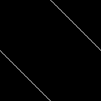
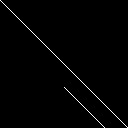
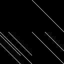

# Säkerhets-SM 2023 final


## [rev] Extreme Guessing

**Skapare:** Jonathan Lööv

**Beskrivning:**
```
Världsmästarna i gissa-talet kan vinna på bara 53 gissningar. Men här är vi inga amatörer, kan du göra bättre?
```

### Översikt
Vi är givna en JavaScript fil `service.js` samt en server med IP och port att ansluta till, varpå samma fil körs. JavaScript filen är ett gissningsspel där vi får gissa ett flyttal som servern tänker på och gissar vi rätt får vi flaggan. När vi gissar får vi veta om vår gissning var för stor eller för liten, men vi får bara ett försök. Gissar vi fel väljs ett nytt tal och samma process upprepas.

```js
if (state === STATE_INIT || state === STATE_TRY_AGAIN) {
    if (line.toLowerCase() == "j") {
        init_guess();
    } else {
        console.log("Hej då.");
        process.exit();
    }
} else if (state === STATE_GUESSING) {
    guess = parseFloat(line);
    if (isNaN(guess)) {
        console.log("För ???");
    } else if (guess > current_number_to_guess) {
        console.log("För högt!");
    } else if (guess < current_number_to_guess) {
        console.log("För lågt!");
    } else {
        console.log("Du vann! Här är flaggan: " + FLAG);
        process.exit();
    }
    current_attempt += 1;
    if (current_attempt < N_GUESSES) {
        console.log("Gissa igen!");
    } else {
        console.log("Du har slut på försök. Tyvärr förlorade du");
        console.log("Spela igen? [J/n]");
        state = STATE_TRY_AGAIN;
    }
}
```

Gissar vi rätt tal får vi flaggan, det är alltså vårt mål. Skickar vi bara in slumpmässiga nummer kommer en  godtycklig gissning vara rätt ungefär 1 gång av 2**52 (på grund av interna grejor vi kommer till). Att fuska låter som en bättre idé.

Så hur genereras gissningen?
```js
function init_guess() {
    state = STATE_GUESSING;
    // current_number_to_guess = NUMBERS[0];
    // NUMBERS = NUMBERS.slice(1);
    current_number_to_guess = Math.random()

    console.log(current_number_to_guess.toString() + " Alright! Jag tänker på ett tal mellan 0 och 1. Vad är din gissning?");
    current_attempt = 0;
}
```

Jo, som kan ses, används JavaScripts inbygga funktion `Math.random()` för att generera varje tal. Internt använder det algoritmen `xorshift128+` som, medan den är elegant i sin enkelhet, har en hel del brister. Dessa brister gör det möjligt att efter tillräckligt många anrop kunna förutse framtida nummer, vilket såklart skulle hjälpa i det här fallet.

Den enda informationen vi kan extrahera om de värden `Math.random()` genererar är om de är större eller mindre än ett godtyckligt flyttal vi anger. Låt oss se hur `Math.random()` fungerar internt för att kanske se hur den lilla informationen kan hjälpa oss.

```c
static inline void XorShift128(uint64_t* state0, uint64_t* state1) {
    uint64_t s1 = *state0;
    uint64_t s0 = *state1;
    *state0 = s0;
    s1 ^= s1 << 23;
    s1 ^= s1 >> 17;
    s1 ^= s0;
    s1 ^= s0 >> 26;
    *state1 = s1;
}

static inline double ToDouble(uint64_t state0) {
    // Exponent for double values for [1.0 .. 2.0)
    static const uint64_t kExponentBits = uint64_t{0x3FF0000000000000};
    uint64_t random = (state0 >> 12) | kExponentBits;
    return base::bit_cast<double>(random) - 1;
}
```

När vi anropar `Math.random()` anropas först `XorShift128()` med de interna variablerna `state0` och `state1`, tillsammans benämna "state". Sedan stoppas `state0`, som modiferades av anropet, in i `ToDouble()` som då kommer generera ett flyttal i intervallet `[0 .. 1)` som till sist ges tillbaka till användaren.

Eller okej, nu ljög jag lite. `XorShift128()` anropas inte vid varje anrop av `Math.random()`. I början av programmet fylls en "bucket" med 64 slumptal från `XorShift128()` och sedan returneras de *backlänges* vid varje anrop till `Math.random()` tills bucketen är tom, varvid den åter fylls på. De returnerade värderna från `Math.random()`, i ordning, kommer alltså se ut så här, där $n_i$ är det i:e nummret från `XorShift128()`.

```math
[n_{63}, n_{62}, \cdots, n_{1}, n_{0}, n_{127}, n_{126}, \cdots]
```

Det är inte jätterelevant för matten bakom det hela, vi kommer bara behöva ta hänsyn till det när vi gör vårt lösningsskript.

### Svagheten

Det som gör `xorshift128+` till en tämligen kass RNG för kryptografiska och säkerhetsrelaterade sammanhang är att den är så kallat linjär. Jag kommer inte motivera varför den är det just nu, men vad det betyder är att det är möjligt att representera de operationer den gör med hjälp av en matris, och matriser vet vi hur man gör matte med.

Vi kommer nu bara anta att den är linjär, om den inte skulle vara det kommer vi inte kunna representera de operationer vi vill och vi skulle i sådana fall märka det.

Så, hur kan vi göra om följden operationer `xorshift128+` utför till en matris? Låt oss jobba steg för steg. Här är den simplifierade algoritmen, i Python för pedagogins sak.
```py
MASK = 2**64-1
def xs128p(s0, s1):
    s0, s1 = s1, s0
    s1 ^= (s1 << 23) & MASK
    s1 ^= s1 >> 17
    s1 ^= s0
    s1 ^= s0 >> 26
    return s0, s1
```

Vi behöver representera hela "statet" som en vektor för att kunna tänka på det hela som en linjär transformation. Vi kommer därför hädanefter använda statet `s0s1`, vilket bara är bitarna i `s0` och `s1` respektive, konkatenerade till varandra.

Eftersom vi jobbar med bitvektorer kommer vi även arbeta under `GF(2)`, vilket är fältet där endast `0` och `1` finns, eftersom det kommer göra mycket av algebran vi behöver göra enklare. Jag kommer inte gå in i detalj över vad det är och hur det fungerar men det viktiga är att addition under `GF(2)` är ekvivalent med XOR.

### Swap
Första steget är att byta plats på värderna i `s0` och `s1`, vilket korresponederar till att byta plats på den övre och lägre halvan av vårt 128-bitars state. Detta kan enkelt göras genom att helt enkelt byta plats på första och sistan halvan av kolumnerna i en 128x128 identitetsmatris. <sub><sub>(det här är ingen linjär algebra kurs så kommer inte göra det mycket tydligare än så)</sub></sub>

Om vi färgar ettor vita och nollor svarta ser vår swap-matris ut så här



Och kan genereras med följande Python kod (`pip install galois numpy`)

```py
import numpy as np
from galois import GF2
SWAP = np.roll(GF2.Identity(128), 64, axis=1)
```

### XOR
Resten av operationerna är någon form av XOR på `s1`, med en shift åt vänster, höger eller ingenting. Låt oss göra en generell funktion som låter oss göra en matris som XOR:ar två områden i statet och spara resultatet i det ena av dem.

```py
def xor(dst, src, size):
    'Create a matrix that XORs two spans of the state together'
    A = GF2.Identity(128)
    A[dst:dst+size,src:src+size] +=  GF2.Identity(size)
    return A
```

Som kan ses adderar vi bara en identitetsmatris över det område vi specificerade. Eftersom addition i GF(2) är som det är kommer det här ha effekten av att XOR:a, verifiera gärna att det stämmer själv. Den första operationen, `s1 << 23`, kan med hjälp av detta skapa en matris som ser ut som så här:



Och kan genereras med följande kod
```py
xor(64+23, 64, 64-23)
```

Vi kommer vilja XOR:a `s1` med både `s1` och `s0`, så låt oss skapa några hjälp funktioner.

```py
# left shift is negative, right shift is positive
def xor_s1_s0(shift):
    'Create a matrix that XORs s1 with a shifted s0'
    if shift > 0: return xor(64, shift, 64-shift)
    else: return xor(64-shift, 0, 64+shift)
    
def xor_s1_s1(shift):
    'Create a matrix that XORs s1 with a shifted s1'
    if shift > 0: return xor(64, 64+shift, 64-shift)
    else: return xor(64-shift, 64, 64+shift)
```

Nu har vi allt vi behöver för att konstruera en matris som representerar hela funktionen. Kom bara ihåg att matrismultiplikation jobbar "baklänges", så den operation vi vill utföra först hamnar sist i kedjan.

```py
XS128P = xor_s1_s0(26)@xor_s1_s0(0)@xor_s1_s1(17)@xor_s1_s1(-23)@SWAP
```

Vilket ger oss vår kompletta matris.



### Informationsläcka

Nu behöver vi hopppa tillbaka till verkligheten för en sekund, och fundera på hur informationen vi kan läcka från utmaningen översätts till det interna statet. Återkalla funktionen `ToDouble()` (python-ifierad):

```c
def to_double(u):
    buf = struct.pack("<Q", (u >> 12) | 0x3FF0000000000000)
    f64 = struct.unpack("d", buf)[0] - 1
    return f64
```

Det den faktiskt gör är att den tar vårt nummer och stoppar in det i *mantissat* av floating-point nummret som skapas. Själva exponenten är konstant och garanterar att talet hamnar mellan `[1.0 .. 2.0)`, vilket är varför den på slutet subtraherar `1` för att få ned talet i intervallet `[0.0 .. 1.0)`. Vare sig du vet hur IEE 754 fungerar eller inte är allt du behöver veta att den högsta biten i input-integern `u`, som kommer från `s0`, kommer sitta i platsen för `1/2` i mantissan. Det betyder att den högsta biten i integern avgör om doublen är större eller mindre än `0.5`.

Det betyder att om vi skickar in talet `0.5` till servern och den säger att den är större eller mindre än `0.5` kommer det svaret avgöra vad den högsta biten i `s0` var vid den iterationen. Det är den läckan vi kommer att använda.

### Lösning

Återkalla att det är sista biten av `s0` vi läcker, och `s0` ligger först i staten. Den läckta biten är alltså `state[63]`. Låt oss kalla statet i början av programmet för $s_0$ och listan av alla läkta bits för $p$. Då ser vår informationsläcka ut som följer, där `A` är matrisen för `xorshift128+`.

```math
(A^0s_0)_{63} = p_0\\
(A^1s_0)_{63} = p_1\\
\vdots\\
(A^{127}s_0)_{63} = p_{127}\\
```

Vi vill helst klämma ihop det här till ett uttryck. För att göra det kan vi konstrura matriserna $S$ där $S_iv$ kommer plocka ut den `64`:de biten ur $v$ och placera den på index $i$, och lämna resten av vektorn fylld med nollor. En sådan matris kan konstrueras som följande:

```py
def extract(i):
    # extracts only the 64th bit and puts it in the ith position
    A = GF2(np.zeros((128,128), dtype=int))
    A[i,63] = 1
    return A
```

Med hjälp av dessa kan vi skriva om ekvationen till

```math
S_{0}A^{0}s_0 + S_{1}A^{1}s_0 + \cdots + S_{127}A^{127}s_0 = p
```

Vi kan nu faktorisera ut $s$

```math
(S_{0}A^{0} + S_{1}A^{1} + \cdots + S_{127}A^{127})s_0 = p
```

Och observera att hela uttrycket inom parantesen blir en matris vi kan beräkna. Vi kan nu lösa för $s_0$

```math
s_0 = (S_{0}A^{0} + S_{1}A^{1} + \cdots + S_{127}A^{127})^{-1}p
```

Då har vi återskapat statet vid början av programmet, så nu kan vi bara fast-forwarda till nutiden och beräkna nästa state $s$. Vi gör 63 extra beräkningar på grund av hur bucketsen vi diskuterade ovan fungerar.

```math
s = A^{128+63}s_0
```

Det är all förklaring jag tror behövs, så nu kommer jag bara dumpa mitt lösningsskript (finns separat [här](./solve.py)). Flaggan vi får ut är `SSM{∀x. NaN_är_varken_större_än_eller_mindre_än_x}`, vilket är en liten nod till en unintended lösning som fanns i första versionen av challen, då den löstes genom att bara skicka in något som inte var en float. Då blir vår gissning `NaN`, som varken är större eller mindre än det korrekta svaret, och därför såklart lika med det. Tack JavaScript.

```py
import struct
import numpy as np

from itertools import chain
from galois import GF2
from tqdm import tqdm
from pwn import *


def to_double(u):
    buf = struct.pack("<Q", (u >> 12) | 0x3FF0000000000000)
    f64 = struct.unpack("d", buf)[0] - 1
    return f64


def bits_to_f64(bi):
    u = 0
    for i, bit in enumerate(map(int, bi)):
        u |= bit << i
    return to_double(u)


def xor(dst, src, size):
    'Create a matrix that XORs two spans of the state together'
    A = GF2.Identity(128)
    A[dst:dst+size, src:src+size] += GF2.Identity(size)
    return A

# left shift is negative, right shift is positive
def xor_s1_s0(shift):
    'Create a matrix that XORs s1 with a shifted s0'
    if shift > 0:
        return xor(64, shift, 64-shift)
    else:
        return xor(64-shift, 0, 64+shift)


def xor_s1_s1(shift):
    'Create a matrix that XORs s1 with a shifted s1'
    if shift > 0:
        return xor(64, 64+shift, 64-shift)
    else:
        return xor(64-shift, 64, 64+shift)


print('[*] Samlar datapunkter...')
io = process('./service.js')
# io = remote('35.217.53.195', 50000, ssl=True)

points = []
for i in tqdm(range(128)):
    io.sendlineafter(b'[J/n]', b'j')
    io.sendlineafter(b'gissning?\n', b'0.5')
    points += [int('lågt!' in io.recvline().decode())]
# Reverse each chunk to get the chronological PRNG output
chunks = [points[i:i+64][::-1] for i in range(0, len(points), 64)]
points = GF2([*chain(*chunks)])

'''
Construct a matrix that is equivalent to:
    s0, s1 = s1, s0
    s1 ^= (s1 << 23)&MASK
    s1 ^= (s1 >> 17)&MASK
    s1 ^= s0 & MASK
    s1 ^= (s0 >> 26) & MASK
'''

SWAP = np.roll(GF2.Identity(128), 64, axis=1)
XS128P = xor_s1_s0(26)@xor_s1_s0(0)@xor_s1_s1(17)@xor_s1_s1(-23)@SWAP


def extract(i):
    # extracts only the 64th bit and puts it in the ith position
    A = GF2.Zeros((128, 128))
    A[i, 63] = 1
    return A


A = GF2.Zeros((128, 128))
MAT_POW = GF2.Identity(128)
for i in range(128):
    A += extract(i)@MAT_POW
    MAT_POW = XS128P @ MAT_POW

original_state = np.linalg.solve(A, points)
# We add 63 since it will have just filled a new bucket
next_state = np.linalg.matrix_power(XS128P, 128+63)@original_state
s0 = next_state[:64]
io.sendlineafter(b'[J/n]', b'j')

guess = bits_to_f64(s0)
io.sendlineafter(b'gissning?\n', str(guess).encode())
print(io.recvline().decode().strip())
```