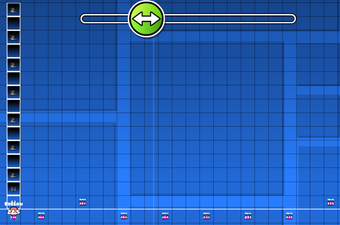

# Hardest Demon Bloodbath by Riot
**Category:** Reversing

**Author:** Plasmatic#0001

**Description:**
```
Whose blood will be spilt in the Bloodbath? Who will the victors be? How many will survive? Good luck...
Geometry Dash Level ID: 87752310
Level Name: CTFCHALL2022
Player ID: TLWv2

Note: Wrap the flag with idek{}
```

## Overview
We are given nothing but this challenge description, containing the level ID for a Geomtry Dash level. Geomtry Dash is a 2D musical plattformer which I so happened to already have installed, so I took a quick look at the level. This was the title and description.


And, when played, we are presented with this.


Well this certainly looks like a flag input, and a long one at that. Counting the bits shows that the whole input contains 256 bits, or 32 chars. Following the input bits is a long stretch oof the level when the player has no control and some patterns flash and move around the screen.


Lastly we hit a huge wall of spikes and we can get a glimpse of the flag we presumably inputed.


Since the description says we will get the flag by beating the level, we can assume that whetever input causes us to  not run into the spike wall will also display a readable flag at the end.

I knew for sure that I would not want to be manually inputing bits into this level, it simply moves too fast and there are too many bits.

Using a discord bot I was able to get the passcode needed to copy the level (`671905`) and open it in the in-game editor. I also wanted to parse the level into Python so I looked for resources about how the level file format works but ended up needing to read the source code of some parsing libraries.

All the levels of the current user are stored in one file: `CCLocalLevels.dat`. This is "encrypted" using a constant XOR key of 11 and packed using base64 and zlib compression. The result is an XML file which after a bit of traversing contains another base64-encoded-zlib-compressed string representing the whole level.
```python
import zlib
from base64 import b64decode
from pwn import xor

def unpack(raw: bytes):
    '''base64.b64decode + zlib.decompress'''
    return zlib.decompress(b64decode(raw, altchars=b'-_')[10:], -zlib.MAX_WBITS).decode()

raw = open('CCLocalLevels.dat', 'rb').read()
lvl_xml_str = unpack(xor(raw, 11))
root = ET.fromstring(lvl_xml_str)
for el in root[0][1]:
    if el.tag != 'd':
        continue
    name = el[3]
    assert name.tag == 's'
    # Find the correct level
    if name.tag != 's' or name.text != 'CTFCHALL2023':
        continue
    lvl_str = unpack(el[5].text+'==')
    break
else:
    print('Could not find the correct level!')
    exit()
```

The level format used for Geomtry Dash is very minimalistic. A world is simply a list of objects, separated by semicolons, and each object is a dictionary with numeric keys corresponding to certain properties of objects, separated by commas. The type of object (i.e spike, wall, etc.) is key `1` and the X and Y position are in `2` and `3`.

For example: the object id for a spike is `8` (I used [this](https://github.com/Rekkonnect/GDAPI/tree/master/GDAPI/GDAPI/Enumerations/GeometryDash) for reference), so if a spike sits at position `(13, 37)` then the object in the level-string would look like.
```
1,8,2,13,3,37;
```

## Triggers
Triggers are what give Geomtry Dash levels their more advanced functionality, they are even possible to [compile a whole language into](https://github.com/Spu7Nix/SPWN-language). The important triggers used in this level are `move` triggers, `toggle` triggers and `collision` triggers. 

### Move triggers
`Move` triggers move things<sup>[citation needed]</sup>. They can be triggered by the player passing by their x-position, the player touching them directly or by other triggers. They target a certain `group` and move everything in that `group` by an X and Y offset. Any object can be assigned as a member of a `group` in the editor and are just named as numbers (`group 1`, `group 2` etc.).

### Toggle-triggers
`Toggle` triggers can be triggered in the same way as `move` triggers and also target a `group`, but instead of moving the members of the `group` the `toggle` trigger completely enables or disables the members of the `group`, effectivly removing them from the level.

### Collision triggers
`Collision` triggers are used in tandem with `collision blocks`. Each `collision block` can assign themselves a `block id`. A `collision` trigger is assigned two `block ids` to look out for and if any two `collision blocks` collide *and* they have the `blocks ids` specified in the `collision` trigger the `collision` trigger will trigger.

When it triggers it can cause any other triggers to trigger. Trigger.

## Level layout
The level consists of 3 main parts: the input, checking and flag.

### Input
The input is fairly straight forward, and looks like this in the editor.


This goes on for 256 bits, as mentioned earlier. The purple dots are `move` triggers and are just far down enough for the player to be able to jump to activate them. The number on the `move` trigger corresponds to the `group` it will move and the black boxes beneth the `0's` are in their respective input's group. The `move` trigger will move their `group` one grid block up, causing the black box above to move and conceal the `0` and reveal a `1`, marking the bit as set. The important thing to rember from this is just that the input arrives through the motion or non-motion of groups `9-264`.

The mechanics used to make this alter what flag is shown in the end is not relevant.

### Checking
This is the part that will need some reversing to be done. We will come back to it, but let's quickly cover the layout of it.

In the beginning of the section there is a vertical tower of `collision blocks` with the `block id` set to `2`, shown as just the digit `2` here. This goes up way past the upper edge of the level editor, so we can't really get a good look at all of them. The whole tower is made to follow the player once the player has past it so the `collision blocks` will slowly scroll across the map together with the player.

Around the ground level are `move` triggers that are either just below or just above the ground. The ones below will not get triggered when the player runs over them, but ones above will. They trigger groups `266-644`. Note that they are all part of the `group 5`, this will be important later.



Along this whole stretch of level there are `collision blocks` with a `block id` of `1` randomly dotted around all the way from the ground to way above the editor bounds.


### Ending
In the end, as mentioned, there is a wall of spikes followed by our entered flag. The spikes are part of `group 7`.

## Parsing
I knew I needed to script this so I made a Python script for parsing the level string, nothing fancy but it works.
```python
# Block properties
ID = '1'
X = '2'
Y = '3'
GROUPS = '57'
BLOCKID = '80'
MOVE_TARGET = '51'

def parse_obj(obj_str: str):
    spl = obj_str.rstrip(',').split(',')
    if len(spl) % 2 != 0:
        return {}
    obj = {spl[i]: spl[i+1] for i in range(0, len(spl), 2)}
    # All objects we care about have these
    if not all(k in obj for k in [X, Y, ID, GROUPS]):
        return {}

    obj[X] = float(obj[X])
    # Everything (ish) is on a grid of 30,
    # this makes things easier later
    obj[Y] = float(obj[Y])//30
    obj[GROUPS] = set(map(int, obj[GROUPS].split('.')))
    return obj

# Filter any empty objects
lvl_objs = [*filter(bool, (parse_obj(obj_str) for obj_str in lvl_str.split(';')))]
```
Now it would also be nice see all the objects that are not within the editor bounds, which should be no problem for us now. Doing this you will also find that there is one single `collision` which has a `block id` of `3`. It will be important for later, so we also save it and then plot the objects we find.
```python
import matplotlib.pyplot as plt
# Block types
MOVE_TRIGGER = '901'
COLLISION_BLOCK = '1816'

moves = []
ones = []
twos = []
last = None
for obj in lvl_objs:
    if obj[ID] == COLLISION_BLOCK:
        if obj[BLOCKID] == '3':  # Special :O
            last = obj
        elif obj[BLOCKID] == '2':  # The blocks in the initial column
            twos.append(obj)
        elif obj[BLOCKID] == '1':  # The blocks scattered everywhere
            ones.append(obj)
    elif obj[ID] == MOVE_TRIGGER:
        moves.append(obj)

def getx(o): return o[X]
def gety(o): return o[Y]

ones = sorted(ones, key=getx)
twos = sorted(twos, key=gety)

print('Generating scatter plot...')
plt.scatter(
    [*map(getx, moves)], [*map(gety, moves)],
    s=1, color='purple')
plt.scatter([*map(getx, ones)], [*map(gety, ones)],
    s=1, color='blue')
plt.scatter([*map(getx, twos)], [*map(gety, twos)],
    s=1, color='red')
plt.scatter([getx(last)], [gety(last)],
    s=20, color='green')
# Line indicating end of inputs,
# the twos are every other line
plt.plot(
    [getx(twos[0]), getx(last)], [256*2, 256*2],
    linestyle='dashed',
    color='gray')
plt.show()
```
This is the result.


I will now be refering to `collision blocks` with `block ids` of `2` as `twos` and a `block ids` of `1` as `ones`. I have drawn an additional line here indicating the 256th `two` in the Tower of Twos™. This is the last `two` that is directly dependant on the input we entered. Along the floor we can see the mess of `move` triggers but in the air we can clearly see all the scattered `ones` and one single `three` up in the right corner. Note that the Tower of Twos™ keep assigning each `two` to a higher group than the last one, with the last one being in `group 644`.

Remember from earlier that the `move` triggers on the floor from the checking-part target groups `266-644`, and that the user input affects groups `9-264` (`group 265` is unaccounted for, doesnt matter). This means the first part of the Tower of Twos™ is affected by the user input directly, and the second part (above the gray line) is affected by the `move` triggers on the floor in the checking stage. Either way each `two` has a corresponding `move` trigger pointing to it.

Now that we have an understanding of the structure of things, we have to understand what all the parts actually do.

## Global functions
In the beginning of the level there is a group of triggers towards the top of the editor. What each of these individual triggers do can be quite terse to figure out; so here is the effects they cause:
 1. When a `one` collides with a `two` move `group 5` up by one block, wait 0.2s and move it back down again
 2. When a `two` collides with a `three` toggle `group 7` on/off.

This clearly states our win condition. `Group 7` is the group the final spikes are part of so if we are able to make a `two` collide with the final `three` the spikes are removed and we win.

`Group 5` is the group all the `move` triggers in the checking stage are part of, which explains the jittering we viewed when playing the level.

## Understanding the circuit
Let's work backwards. We need the `three` to collide with a `two`. `Twos` can be moved up by one block by their corresponding move trigger, either in the input or along the ground in the checking-phase. By inspecting the y-positions of the blocks via Python we can see that there is no `two` on the same level as the `three`, but there is one one block down.

That means we need that `two` to be moved upwards by triggering it's corresponding `move` trigger, which can easily be found by searching all the triggers and looking for the one targeting the correct group.

So how does this `move` trigger get activated? Well, when the player runs over it. It's one of the triggers along the ground. If it's above the ground then we're all set we need it to stay put, it will be triggered once the player passes by. If it's not we need this `move` trigger to be moved upwards right when the player passes by.

This is done by having a `one` hit a `two` right above the trigger, causing global rule #1 to take effect. So how can we ensure that? Well we look at all the `ones` that are right above the trigger and try to find the state that causes them to collide with a `two`, just as we now did with the last `three`. We are back where we started and are now at a point where we can write a recursive algorithm to find all the conditions that need to be met. When we have that we just throw Z3 at it and we (hopefully) should get our answer.

## Solution

This is the final part of my solution script, view the full one [here](solve.py)

```python
from z3 import *

input_vars = [Bool(str(i)) for i in range(256)]
def find_assertions(curr):
    '''Return a Z3 expression for when this block is triggered'''
    try:
        two = next(t for t in reversed(twos) if t[Y] == curr[Y])
        should_trigger = False
    except StopIteration:
        two = next(t for t in reversed(twos) if t[Y]+1 == curr[Y])
        should_trigger = True

    two_id = [*(two[GROUPS]-{265, 1001})][0]
    if two_id < 266:  # Input
        return input_vars[two_id-9] if should_trigger else Not(input_vars[two_id-9])

    # Corresponding move-trigger
    m = next(m for m in moves if int(m[MOVE_TARGET]) == two_id)

    # its -1.0 or 0.0, -1.0 meaning it currently wont trigger when ran over
    should_trigger = should_trigger if m[Y] == -1.0 else not should_trigger
    asserts = [find_assertions(one) for one in ones if one[X] == m[X]]
    expr = Or(*asserts)
    if not should_trigger:
        expr = Not(expr)
    return expr

s = Solver()
s.add(find_assertions(last))
assert s.check() == sat
m = s.model()
out = ''
# Chunks of 8
for chunk in zip(*[iter(input_vars)]*8):
    # 8 bools to an int
    out += chr(sum(2**i for i, v in enumerate(chunk[::-1]) if m[v]))
print('idek{'+out+'}')
```