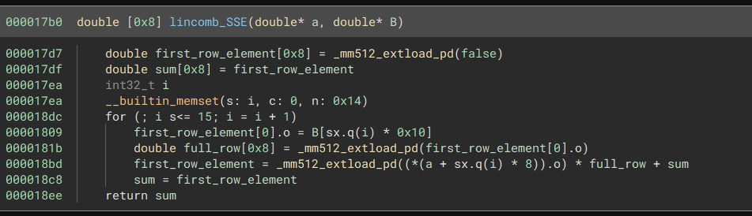

### Prelude

This is a challenge which relies on the AVX-512 instruction set and other vector instructions to obfuscate a program. To aid in our reversing efforts we construct a Binary Ninja plugin which allows us to lift any unimplemented instructions to Binja's low level IL, allowing us to analyze the program utilizing the full decompiler toolset Binja offers.

## [rev] Sahuang Flag Checker

**Author:** Iy3dMejri

**Description:**
```
Can you figure out what master sahuang flag checker is doing to satisfy the 🐸?

❖ Note Your CPU needs to support AVX-512 to run the binary.
```

### Initial impression

We are given a crackme-style binary which asks for a flag and says whether it's correct or not. Or, well, it's supposed to at least.
```
❯ ./sahuang
Enter the flag: is_this_the_flag?
zsh: illegal hardware instruction  ./sahuang
```

As mentioned in the challenge description this challenge requires support for the `AVX-512` instruction set for `x86_64`, which I don't have (check [supported CPUs](https://en.wikipedia.org/wiki/AVX-512#CPUs_with_AVX-512)). I did not manage to make Qemu work with it either (please tell me if you did), but [Intel® SDE](https://www.intel.com/content/www/us/en/developer/articles/tool/software-development-emulator.html) worked semi-flawlessly so I was able to run and debug the binary locally.

```
❯ ./sde -knl -- ../sahuang
Enter the flag: how_about_this?

Master Sahuang isn't satisfied with your input!
```

So let's now fire it up in our decompiler of choice.

### Initial Analysis

Well, it looks like shit.


Right of the bat we see that Binary Ninja seems to have serious trouble with the stack. If we look at the disassembly we can find a likely culprit.


This zeros out the last 6 bits of the stack pointer to ensure it's aligned to a 64-byte boundary. This is quite common to see in programs dealing with advanced vector instructions, since many of them need their addresses (which may come from the stack) to be aligned to some degree. Binja sadly gets confused by this and completely looses track of the stack structure, but we can help it by simply `nop`-ing out the offending instruction, which shouldn't be relevant to our analysis.

We now get this much more readable decompilation. (I've gone ahead and annotated some variables already)


As we can see it reads in at most `60` characters from `stdin` and then pads them with the char `'X'` until it its length is a a multiple of `16`.

It then enters an outer loop which increments `off` by `16` every time until it is greater or equal to the input length, essentially looping over every block of `16` characters in our input.

### First step

Each iteration of the loop will first execute the following block of code:


`B_ptr` here is a pointer into a `256` long array of `double`s (`B`). We see some ugly intrinsics that Binja wasn't able to lift, but the gist is that each of our first `16` characters are placed into every `16`th slot in `B`, after first being transformed by `rc(ch-33, 3)` and then converted from an integer to a double, i.e `88` -> `88.0`.

If we consider `B` to be a row-major `16x16` matrix, this corresponds to putting our transformed characters in the first column.

$$
B = \begin{bmatrix}
rc(c_0-33,\ 3) & 0 & \dots & 0 \\
rc(c_1-33,\ 3) & 0 & \dots & 0 \\ 
\vdots & \vdots & \ddots & 0 \\
rc(c_{15}-33,\ 3) & 0 & 0 & 0
\end{bmatrix}
$$

Lastly this matrix `B` is passed into `matmult_SSE4` together with a constant matrix `A`, with the output supposedly being saved to `C`. We'd better check that this matmult function actually does what it says.

If we set a breakpoint before it's called we can extract the two matrices, and if we then run until it finishes we can extract the result. With `aaaaaaaaaaaaaaaa` as the input block, `A` looks like this:

$$
\begin{bmatrix}
55 & 81 & 66 & 68 & 86 & 67 & 51 & 34 & 88 & 43 & 44 & 70 & 65 & 51 & 93 & 54\\
73 & 45 & 54 & 35 & 82 & 59 & 67 & 84 & 87 & 46 & 69 & 46 & 46 & 80 & 79 & 51\\
39 & 50 & 57 & 67 & 51 & 68 & 61 & 32 & 79 & 48 & 35 & 90 & 63 & 69 & 66 & 52\\
70 & 55 & 64 & 40 & 52 & 84 & 79 & 77 & 51 & 60 & 74 & 57 & 95 & 78 & 93 & 41\\
70 & 77 & 58 & 78 & 68 & 83 & 49 & 37 & 90 & 53 & 61 & 91 & 65 & 65 & 95 & 58\\
71 & 64 & 91 & 90 & 87 & 57 & 53 & 75 & 48 & 68 & 48 & 69 & 73 & 63 & 47 & 51\\
63 & 49 & 74 & 50 & 52 & 95 & 32 & 83 & 65 & 85 & 66 & 53 & 85 & 74 & 42 & 81\\
33 & 46 & 63 & 85 & 39 & 80 & 89 & 50 & 62 & 70 & 47 & 70 & 39 & 56 & 54 & 61\\
67 & 36 & 84 & 70 & 91 & 58 & 68 & 87 & 33 & 77 & 91 & 88 & 87 & 46 & 66 & 67\\
60 & 80 & 35 & 79 & 69 & 45 & 54 & 79 & 76 & 49 & 38 & 75 & 35 & 77 & 70 & 91\\
91 & 74 & 63 & 55 & 63 & 76 & 83 & 39 & 61 & 69 & 61 & 49 & 92 & 34 & 75 & 52\\
87 & 80 & 83 & 43 & 36 & 49 & 62 & 86 & 51 & 49 & 67 & 65 & 69 & 92 & 95 & 42\\
44 & 66 & 68 & 88 & 79 & 45 & 46 & 70 & 74 & 94 & 75 & 50 & 75 & 77 & 66 & 66\\
48 & 39 & 58 & 73 & 65 & 66 & 63 & 77 & 56 & 80 & 85 & 57 & 79 & 58 & 78 & 64\\
37 & 78 & 75 & 90 & 78 & 49 & 76 & 79 & 68 & 82 & 76 & 87 & 82 & 73 & 52 & 46\\
93 & 36 & 34 & 41 & 94 & 55 & 42 & 58 & 54 & 37 & 40 & 76 & 90 & 95 & 40 & 75\\
\end{bmatrix}
$$

And `B` looks like this

$$
\begin{bmatrix}
64 & 0 & 0 & 0 & 0 & 0 & 0 & 0 & 0 & 0 & 0 & 0 & 0 & 0 & 0 & 0\\
64 & 0 & 0 & 0 & 0 & 0 & 0 & 0 & 0 & 0 & 0 & 0 & 0 & 0 & 0 & 0\\
64 & 0 & 0 & 0 & 0 & 0 & 0 & 0 & 0 & 0 & 0 & 0 & 0 & 0 & 0 & 0\\
64 & 0 & 0 & 0 & 0 & 0 & 0 & 0 & 0 & 0 & 0 & 0 & 0 & 0 & 0 & 0\\
64 & 0 & 0 & 0 & 0 & 0 & 0 & 0 & 0 & 0 & 0 & 0 & 0 & 0 & 0 & 0\\
64 & 0 & 0 & 0 & 0 & 0 & 0 & 0 & 0 & 0 & 0 & 0 & 0 & 0 & 0 & 0\\
64 & 0 & 0 & 0 & 0 & 0 & 0 & 0 & 0 & 0 & 0 & 0 & 0 & 0 & 0 & 0\\
64 & 0 & 0 & 0 & 0 & 0 & 0 & 0 & 0 & 0 & 0 & 0 & 0 & 0 & 0 & 0\\
64 & 0 & 0 & 0 & 0 & 0 & 0 & 0 & 0 & 0 & 0 & 0 & 0 & 0 & 0 & 0\\
64 & 0 & 0 & 0 & 0 & 0 & 0 & 0 & 0 & 0 & 0 & 0 & 0 & 0 & 0 & 0\\
64 & 0 & 0 & 0 & 0 & 0 & 0 & 0 & 0 & 0 & 0 & 0 & 0 & 0 & 0 & 0\\
64 & 0 & 0 & 0 & 0 & 0 & 0 & 0 & 0 & 0 & 0 & 0 & 0 & 0 & 0 & 0\\
64 & 0 & 0 & 0 & 0 & 0 & 0 & 0 & 0 & 0 & 0 & 0 & 0 & 0 & 0 & 0\\
64 & 0 & 0 & 0 & 0 & 0 & 0 & 0 & 0 & 0 & 0 & 0 & 0 & 0 & 0 & 0\\
64 & 0 & 0 & 0 & 0 & 0 & 0 & 0 & 0 & 0 & 0 & 0 & 0 & 0 & 0 & 0\\
64 & 0 & 0 & 0 & 0 & 0 & 0 & 0 & 0 & 0 & 0 & 0 & 0 & 0 & 0 & 0\\
\end{bmatrix}
$$

So one would expect `C` (`A*B`) to then equal:

$$
\begin{bmatrix}
65024 & 0 & 0 & 0 & 0 & 0 & 0 & 0 & 0 & 0 & 0 & 0 & 0 & 0 & 0 & 0\\
64192 & 0 & 0 & 0 & 0 & 0 & 0 & 0 & 0 & 0 & 0 & 0 & 0 & 0 & 0 & 0\\
59328 & 0 & 0 & 0 & 0 & 0 & 0 & 0 & 0 & 0 & 0 & 0 & 0 & 0 & 0 & 0\\
68480 & 0 & 0 & 0 & 0 & 0 & 0 & 0 & 0 & 0 & 0 & 0 & 0 & 0 & 0 & 0\\
70272 & 0 & 0 & 0 & 0 & 0 & 0 & 0 & 0 & 0 & 0 & 0 & 0 & 0 & 0 & 0\\
67520 & 0 & 0 & 0 & 0 & 0 & 0 & 0 & 0 & 0 & 0 & 0 & 0 & 0 & 0 & 0\\
67136 & 0 & 0 & 0 & 0 & 0 & 0 & 0 & 0 & 0 & 0 & 0 & 0 & 0 & 0 & 0\\
60416 & 0 & 0 & 0 & 0 & 0 & 0 & 0 & 0 & 0 & 0 & 0 & 0 & 0 & 0 & 0\\
71424 & 0 & 0 & 0 & 0 & 0 & 0 & 0 & 0 & 0 & 0 & 0 & 0 & 0 & 0 & 0\\
64768 & 0 & 0 & 0 & 0 & 0 & 0 & 0 & 0 & 0 & 0 & 0 & 0 & 0 & 0 & 0\\
66368 & 0 & 0 & 0 & 0 & 0 & 0 & 0 & 0 & 0 & 0 & 0 & 0 & 0 & 0 & 0\\
67584 & 0 & 0 & 0 & 0 & 0 & 0 & 0 & 0 & 0 & 0 & 0 & 0 & 0 & 0 & 0\\
69312 & 0 & 0 & 0 & 0 & 0 & 0 & 0 & 0 & 0 & 0 & 0 & 0 & 0 & 0 & 0\\
66944 & 0 & 0 & 0 & 0 & 0 & 0 & 0 & 0 & 0 & 0 & 0 & 0 & 0 & 0 & 0\\
72192 & 0 & 0 & 0 & 0 & 0 & 0 & 0 & 0 & 0 & 0 & 0 & 0 & 0 & 0 & 0\\
61440 & 0 & 0 & 0 & 0 & 0 & 0 & 0 & 0 & 0 & 0 & 0 & 0 & 0 & 0 & 0\\
\end{bmatrix}
$$

But instead what we get is this:

$$
\begin{bmatrix}
65024 & 65024 & 65024 & 65024 & 65024 & 65024 & 65024 & 65024 & 64448 & 64448 & 64448 & 64448 & 64448 & 64448 & 64448 & 64448\\
64192 & 64192 & 64192 & 64192 & 64192 & 64192 & 64192 & 64192 & 59456 & 59456 & 59456 & 59456 & 59456 & 59456 & 59456 & 59456\\
59328 & 59328 & 59328 & 59328 & 59328 & 59328 & 59328 & 59328 & 65472 & 65472 & 65472 & 65472 & 65472 & 65472 & 65472 & 65472\\
68480 & 68480 & 68480 & 68480 & 68480 & 68480 & 68480 & 68480 & 68416 & 68416 & 68416 & 68416 & 68416 & 68416 & 68416 & 68416\\
70272 & 70272 & 70272 & 70272 & 70272 & 70272 & 70272 & 70272 & 74624 & 74624 & 74624 & 74624 & 74624 & 74624 & 74624 & 74624\\
67520 & 67520 & 67520 & 67520 & 67520 & 67520 & 67520 & 67520 & 61760 & 61760 & 61760 & 61760 & 61760 & 61760 & 61760 & 61760\\
67136 & 67136 & 67136 & 67136 & 67136 & 67136 & 67136 & 67136 & 66304 & 66304 & 66304 & 66304 & 66304 & 66304 & 66304 & 66304\\
60416 & 60416 & 60416 & 60416 & 60416 & 60416 & 60416 & 60416 & 65280 & 65280 & 65280 & 65280 & 65280 & 65280 & 65280 & 65280\\
71424 & 71424 & 71424 & 71424 & 71424 & 71424 & 71424 & 71424 & 67584 & 67584 & 67584 & 67584 & 67584 & 67584 & 67584 & 67584\\
64768 & 64768 & 64768 & 64768 & 64768 & 64768 & 64768 & 64768 & 67520 & 67520 & 67520 & 67520 & 67520 & 67520 & 67520 & 67520\\
66368 & 66368 & 66368 & 66368 & 66368 & 66368 & 66368 & 66368 & 65216 & 65216 & 65216 & 65216 & 65216 & 65216 & 65216 & 65216\\
67584 & 67584 & 67584 & 67584 & 67584 & 67584 & 67584 & 67584 & 66304 & 66304 & 66304 & 66304 & 66304 & 66304 & 66304 & 66304\\
69312 & 69312 & 69312 & 69312 & 69312 & 69312 & 69312 & 69312 & 68224 & 68224 & 68224 & 68224 & 68224 & 68224 & 68224 & 68224\\
66944 & 66944 & 66944 & 66944 & 66944 & 66944 & 66944 & 66944 & 71616 & 71616 & 71616 & 71616 & 71616 & 71616 & 71616 & 71616\\
72192 & 72192 & 72192 & 72192 & 72192 & 72192 & 72192 & 72192 & 65216 & 65216 & 65216 & 65216 & 65216 & 65216 & 65216 & 65216\\
61440 & 61440 & 61440 & 61440 & 61440 & 61440 & 61440 & 61440 & 32448 & 32448 & 32448 & 32448 & 32448 & 32448 & 32448 & 32448\\
\end{bmatrix}
$$

It is clearly not normal matrix multiplication. As it turns out this doesn't actually matter in the end because only the first column of the resultant matrix is used, which happends to match the correct matrix multiplication. During the competition, however, we didn't have the full picture yet so we decided to try and understand what it is that's actually happening under the hood, and who knows, maybe we'll learn something along the way.

### Understanding matmult_SSE4

We are once again greeted with a thoroughly messed up decompilation.


Once again the stack alignment seems to be the culprit. We could just manually patch the `and rsp, ...` out, but I have a feeling that we'll want to do this a lot, and maybe some other modifications as well, so let's write a Binary Ninja plugin to automate this for us.

```py
from binaryninja import *
from capstone import *
from capstone.x86 import *

md = Cs(CS_ARCH_X86, CS_MODE_64)
md.detail = True

class Patch(ArchitectureHook):
    def get_instruction_low_level_il(self, data: bytes, addr: int, il: LowLevelILFunction) -> int | None:
        instr = next(md.disasm(data, addr))
        length = instr.size

        if instr.mnemonic == 'and' and \
        instr.operands[0].type == X86_OP_REG and \
        instr.operands[0].reg == X86_REG_RSP:
            il.nop()
            return length

        return super().get_instruction_low_level_il(data, addr, il)

Patch(x86_64).register()
```

Using `capstone` here instead of Binja's builtin disassembler might seem overkill at first, but this choice foreshadows some reasons which I'll get to shortly.

Now we have something a lot more readable, but still littered with annoying intrinsics.


Ignoring the specifics for now, we can already see that there's some weird stuff going on. `A`, `B` and `C` are all `16x16` matrices. A common way to compute matrix products is something along these lines:

```py
def matmult(A, B):
    C = zero_matrix(16)
    for i in range(16):
        C[i] = A[i] * B
    return C
```

Here `A[i]*B` denotes a vector times a matrix, resulting in another vector. This is sometimes called a linear combination and is what I suspect is happening in `lincomb_SSE`.

But then why is the outer loop running `32` times? And we are indexing `A` by `8*i`, essentially pulling out each row as if it were a `8x32` matrix? Something just ain't right.

### lincomb_SSE


In `matmult_SSE4` we could extrapolate what the intrinsics where doing just by the control flow structure, but this is just on another level.

If you were to analyze this a bit more closely, which I'll spare you the details of, you will notice that there are some things that fundementally does not make sense. Take a look at the beginning of the function.


Look at the last instruction here. We are reading from `[rsp-0xa]` and storing it in `zmm0`, but `[rsp-0xa]` has not been written to yet; it would be reading some random uninitialized memory.

Let's now compare this to what `objdump` thinks is happening.

```x86asm
    17b0:       f3 0f 1e fa             endbr64
    17b4:       55                      push   rbp
    17b5:       48 89 e5                mov    rbp,rsp
    17b8:       48 83 e4 c0             and    rsp,0xffffffffffffffc0
    17bc:       48 81 ec 88 01 00 00    sub    rsp,0x188
    17c3:       48 89 7c 24 a0          mov    QWORD PTR [rsp-0x60],rdi
    17c8:       48 89 74 24 98          mov    QWORD PTR [rsp-0x68],rsi
    17cd:       c5 f9 57 c0             vxorpd xmm0,xmm0,xmm0
    17d1:       c5 fb 11 44 24 b0       vmovsd QWORD PTR [rsp-0x50],xmm0
    17d7:       62 f2 fd 48 19 44 24    vbroadcastsd zmm0,QWORD PTR [rsp-0x50]
```

It's now reading from `[rsp-0x50]`? This is the output we also get from several other different disassemblers, Binary Ninjas disassembler is simply wrong. This is why I chose to use `capstone` earlier for the patching plugin. We can now use it to also patch these incorrect instructions to the correct ones!

I should preface by saying that these patches are made specifically for this binary, it may be completely incorrect in some cases. 

First we define this incredible ugly function to convert a `capstone` instruction operand to Binary Ninja's low level IL.

```py
def from_op(op: X86Op, il: LowLevelILFunction, instr=None, dont_load=False) -> LowLevelILExpr:
    if op.type == X86_OP_REG:
        return il.reg(op.size, md.reg_name(op.reg))
    elif op.type == X86_OP_IMM:
        return il.const(op.size, op.imm)
    elif op.type == X86_OP_MEM:
        m = il.const(8, 0)
        if op.mem.disp != 0:
            m = il.add(8, m, il.const(8, op.mem.disp))
        if op.mem.base != 0:
            if op.mem.base == X86_REG_RIP and instr is not None:
                m = il.add(8, m, il.const(8, il.current_address + instr.size))
            else:
                m = il.add(8, m, il.reg(8, md.reg_name(op.mem.base)))
        if op.mem.index != 0:
            m = il.add(8, m, il.mult(8,
                    il.reg(8, md.reg_name(op.mem.index)),
                    il.const(8, op.mem.scale)))
        if not dont_load:
            m = il.load(op.size, m)
        return m
    else:
        raise ValueError('Unknown operand type: {}'.format(op.type))
```

We can now add this case to our lifter function.

```py
if instr.mnemonic in ['vbroadcastsd']:
    # We keep as intrinsic but replace anyway since Binja's disassembly is wrong
    o_il = LowLevelILFunction(x86_64)
    super().get_instruction_low_level_il(data, addr, o_il)
    intrinsic = o_il[0].intrinsic.name
    il.append(il.intrinsic([md.reg_name(instr.operands[0].reg)], intrinsic, [from_op(instr.operands[1], il, instr)]))
    return length
```

We also have cases like these:


This works exactly like a regular store, with the added detail that `k0` is used as a mask. Though in our program it's always zero, so to make things more readable we can turn this into a regular store. Let's also add `xor` while we're at it.

```py
if instr.mnemonic in ['vmovsd', 'vmovapd', 'vmovss', 'vmovdqa']:
    sz = instr.operands[0].size
    if instr.operands[0].type == X86_OP_MEM:
        il.append(il.store(sz,
            from_op(instr.operands[0], il, instr, True),
            from_op(instr.operands[-1], il, instr)))
    elif instr.operands[0].type == X86_OP_REG:
        il.append(il.set_reg(sz,
            md.reg_name(instr.operands[0].reg),
            from_op(instr.operands[-1], il, instr)))
    else:
        raise ValueError(f'Unknown operand type: {instr.operands[0].type}')
    return length

if instr.mnemonic in ['vxorpd', 'vxorps']:
    assert instr.operands[0].type == X86_OP_REG
    sz = instr.operands[0].size
    src = il.xor_expr(sz,
        from_op(instr.operands[0], il, instr),
        from_op(instr.operands[1], il, instr))
    il.append(il.set_reg(sz, md.reg_name(instr.operands[0].reg), src))
    return length
```

We now get:


Wow, what a difference huh? The remaining intrinsics are a little bit more annoying to lift. `_mm512_extload_pd` is a broadcast operation which takes a `double` (8 bytes) and places 8 copies of it next to eachother in the target register. Lifting this would arguably just make things less readable.

`__vaddpd_...` and `__vmulpd_...` are pairwise operations, treating their input as two arrays and multiplying corresponding elements with eachother. We could leave this too as-is with a slightly more verbose decompilation, or we can be a little naughty tell Binja a white lie. Namely that it's actually just normal addition/multiplication, and we'll keep a mental note that we're treating them as array operations.

```py
# WARNING: very bad and naughty, but it looks so good decompiled ;-;
if instr.mnemonic in ['vmulpd', 'vaddpd']:
    operation = [il.mult, il.add][instr.mnemonic == 'vaddpd']

    sz = instr.operands[0].size
    il.append(il.set_reg(sz, md.reg_name(instr.operands[0].reg),
        operation(
            sz,
            from_op(instr.operands[1], il, instr),
            from_op(instr.operands[2], il, instr)))
    )
    return length
```




Look at this beauty. Now we can now easily translate this to pseudo-code (aka Python).

```py
def lincomb_SSE(a, B):
    vsum = 0
    for i in range(16):
        vsum += a[i] * B[i * 16]
    return [vsum] * 8

def matmult(A, B):
    C = [0]*256
    for i in range(32):
        C[i*8:i*8+8] = lincomb_SSE(A[i*8:i*8+16], B)
    return C
```

The astute might've noticed that this will actually overflow `A` on the last iteration, reading `31*8+16 - 256 = 8` bytes out-of-bounds. The section it lives in has room for this so it doesn't crash the program, but I thought it was interesting nonetheless.

Let's now also revisit `rc()` which transforms each of our input characters.


Too many broadcasts for my taste. Since the output is just a single byte, let's once again be a little naughty and treat the broadcasts here as simple `mov`s. If we wanna be proper about it we can even restrict this simplification to only this function, and let's also add `vpslld` and  `vpsrld`

```py

movs = ['vmovsd', 'vmovapd', 'vmovss', 'vmovdqa']
if il.source_function.name == 'rc': movs += ['vpbroadcastb']
if instr.mnemonic in movs:
    ... # from earlier

if instr.mnemonic in ['vpsrld', 'vpslld']:
    assert all(op.type == X86_OP_REG for op in instr.operands)
    operation = [il.shift_left, il.logical_shift_right][instr.mnemonic == 'vpsrld']
    sz = instr.operands[0].size
    il.append(il.set_reg(sz,
        md.reg_name(instr.operands[0].reg),
        operation(sz,
            from_op(instr.operands[1], il, instr),
            from_op(instr.operands[2], il, instr))
    ))
    return length
```

We now get this:


Which just rotates the lower 4 bits of `a` left by `b` bits. Written as some bitwise pseudocode: `a[8:4] || ROL4(a[4:0], b & 0xf)`, or as regular python:

```py
def rc(a, b):
    return ((((a & 0xf) << b) | ((a & 0xf) >> (4 - b))) & 0xf) | (a & 0xf0)
```

### Second step

We can now finally move on to the second step of the outermost loop, which looks like this.


You know the drill by now, let's get rid of those intrinsics.

```py
if instr.mnemonic in ['vcvtusi2ss']:
    sz = instr.operands[0].size
    src_sz = instr.operands[2].size
    il.append(il.set_reg(sz, md.reg_name(instr.operands[0].reg),
        il.float_convert(src_sz, from_op(instr.operands[2], il, instr)))
    )
    return length

if instr.mnemonic in ['vcvttss2usi', 'vcvttsd2usi']:
    sz = instr.operands[0].size
    src_sz = instr.operands[1].size
    il.append(il.set_reg(sz, md.reg_name(instr.operands[0].reg),
        il.float_trunc(src_sz, from_op(instr.operands[1], il, instr)))
    )
    return length
```

We now have this.


`add`, `sub`, and `mul` actually do what their name would suggest in this case. They are equally littered with unnecessary vector operations as what we've looked at before, so I'll spare you the details and hope you'll take my word for it. 

I'm not sure why, but `0x42bc0000` didn't get translated to a floating point value in this decompilation. If it were you would see that it was `94.0`. Furthermore, `0.0106382975` is actually just `1/94.0`. Using this we can produce this equivalent code:

```py
# C is a 16x16 matrix
for i in range(16):
    out[i] = (C[i][0] - (C[i][0] // 94) * 94) + 33
```

Which is actually just an optimized way to write modulo:

```py
for i in range(16):
    out[i] = (C[i][0] % 94) + 33
```

*Finally* this is checked against some constants and then the program tells us whether we entered the correct flag or not.


### The full algorithm

Let's now take a step back after digging in the weeds and consider the final algorithm from start to finish. I've turned the janky matrix multiplication used in the program to a normal one since we are only accessing the first column after it is computed, and the first column is actually correct.

```py
def rc(a, b):
    return ((((a & 0xf) << b) | ((a & 0xf) >> (4 - b))) & 0xf) | (a & 0xf0)

A = ...
targets = ...
inp = input().ljust(48, 'X').encode()
for i in range(3):
    B = zero_matrix(16, 16)
    for j in range(16):
        B[i][0] = rc(inp[16*i+j] - 33, 3)
    C = A*B

    assert targets[i] == [(C[j][0]%94)+33 for j in range(16)]
```

The inverse of `rc(a, b)` is just `rc(a, 4 - b)`, so we can simply replace `3` with `1` as the second argument. Addition/subtraction with `33` is of course also easily invertible, so we are left with the matrix multiplication modulo `94`.

Solving a matrix equation over a finite ring is not something we want to do ourselves (especially not with a composite modulus) so we instead hand that problem over to [Sage](https://www.sagemath.org/).

First, however, we need to extract all the relevant data, which this Binja snippet will do.

```py
import re
import json
from struct import pack, unpack
from pathlib import Path
import numpy as np
from binaryninja import *

# Load the coefficient matrix
A = np.array(
    unpack('d'*256, bv.read(
        bv.get_symbols_by_name('A')[0].address,
        256*8))
).astype(np.int64).reshape(16, 16)

targets = []
main = bv.get_functions_by_name('main')[0]

# Extract blocks from HLIL
hlil = str(main.hlil)
for i in range(0, 8, 2):
    block = b''
    for j in range(2):
        n = int(next(re.finditer(f'(0x[0-9a-f]+) \\^ out\\[{i+j}\\]', hlil)).group(1), 0)
        block += pack('<Q', n)
    # We subtract 33 here already because we can
    targets.append([b-33 for b in block])

out = {
    'A': A.tolist(),
    'targets': targets
}
with open(Path(bv.file.filename).parent/'extracted.json', 'w') as f:
    json.dump(out, f)
```

Now we can hand this over to Sage and watch as the flag pops out.

```py
import json

def rc(a, b):
    return ((((a & 0xf) << b) | ((a & 0xf) >> (4 - b))) & 0xf) | (a & 0xf0)

with open('./extracted.json', 'rb') as f:
    out = json.load(f)

R = Zmod(94)
targets = out['targets']
A = matrix(R, out['A'])
for target in targets:
    # TYL: this is valid sage syntax
    v = A \ vector(R, target)
    print(end=bytes([rc(int(b), 1)+33 for b in v]).decode())
# -> SEKAI{1_I_i_|_H0oOo@p3eEe_Y0Uu\_/Didn't_BruT3F0rCe_GuYy5}XXXXXXX
```

### Afterthoughts

In the end it really wasn't a complicated algoritm, but the tooling for decompiling these kinds of programs in a nice and readable way just doesn't seem to exist.

You might've gotten a bad impression of Binary Ninja's capabilities when it comes to modern vector instructions, but the truth is that all big decompilers struggled just as much if not more. IDA refuses to even decompile the offending instructions and leaves it as inline assembly, which is obviously cheating, and Ghidra fails to even disassemble the instructions, leaving us with a sad `halt_baddata();`.

Binary Ninja lifted it to intrinsics and because of it's extensive API I was able to modify it to fit my needs (although I'm still a bit grumpy about the incorrect disassembly).
