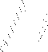
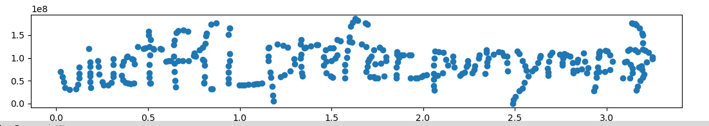

## [rev] Pwnymaps

**Author:** spicypete

**Description:**
```
My friend gave me his address, but the coords he gave are n dimensional... Can you help me setup my GPS to find him?

Once you pass all checks, you need to plot all the x, y points in order as a line plot in order to reveal the flag. The flag consists of three valid words seperated by underscores, wrapped in the flag format, and all lowercase.
```

### Initial impressions
Explicit reversing of minor details in a program rarely leads to a good writeup to read, so I'll summarize the high level of the program flow here.

It first asks for a "complexity level", which will be an integer, after which we are prompted that number of times for a pair of numbers. The pairs are 'earth'-type coordinates since they have just two components.

```
❯ ./pwnymaps 
*****************
* PWNYMAPS v0.1 *
*****************
The developer has only tested non-earth planetary systems. Please proceed with caution.
Indicate your directional complexity level: 2
Indicate your 'Earth'-type coordinate 0 {{hintText.toUpperCase()}}: 5 2
Indicate your 'Earth'-type coordinate 1 {{hintText.toUpperCase()}}: 3 5
Continue straight for 500 meter(s) into Lake Michigan.
```

Continuing into Lake Michigan is, of course, not something we want to do since our friend lives on land, so that is the message we will want to avoid. Looking at the strings, we can see: `You have reached your destination. PWNYMAPS does not support route plotting yet.` We thus have a goal.

### What a mess

Opening up the binary in your decompiler of choice, you will see that this is the part of `main()` that is responsible for the logic of the program. 

```c
int  main(int argc, const char **argv, const char **envp)
{
  // initalization stuff
  printf("%s", "Indicate your directional complexity level: ");
  __isoc99_scanf("%u", &complex_lvl);
  getchar();
  if ( complex_lvl > 0x200 )
    goto fail;
  v14 = 1;
  for ( k = 0; k < complex_lvl; ++k )
  {
    printf("Indicate your 'Earth'-type coordinate %x {{hintText.toUpperCase()}}: ", k);
    __isoc99_scanf("%u%u", &x, &y);
    getchar();
    if ( y > 0xFFFFFFF )
      goto fail;
    v19 = x >> 8;
    v6 = (16 * x) & 0xFF0 | (y >> 28);
    v7 = HIWORD(y) & 0xFFF;
    v8 = EncodeMorton_12bit(y >> 10, (y >> 4) & 0x3F);
    v20 = EncodeMorton_24bit(v8, v7);
    v24 = EncodeMorton_48bit(v19, v7);
    v25 = (v24 << 12) | v6;
    arr[8 * k] = Unpad64Bit_8Bit(v25);
    arr[8 * k + 1] = Unpad64Bit_8Bit(v25 >> 1);
    arr[8 * k + 2] = Unpad64Bit_8Bit(v25 >> 2);
    arr[8 * k + 3] = Unpad64Bit_8Bit(v25 >> 3);
    arr[8 * k + 4] = Unpad64Bit_8Bit(v25 >> 4);
    arr[8 * k + 5] = Unpad64Bit_8Bit(v25 >> 5);
    arr[8 * k + 6] = Unpad64Bit_8Bit(v25 >> 6);
    arr[8 * k + 7] = Unpad64Bit_8Bit(v25 >> 7);
    v5 = arr[8 * k + 1];
    arr[8 * k + 1] = arr[8 * k + 5];
    arr[8 * k + 5] = v5;
    v21 = numberOfSetBits((((arr[8 * k + 4] << 8) | arr[8 * k + 5]) ^ ((arr[8 * k + 2] << 8) | arr[8 * k + 3]) ^ (arr[8 * k + 1] | (arr[8 * k] << 8)) ^ ((arr[8 * k + 6] << 8) | arr[8 * k + 7])));
    v3 = correct_checksums[k];
    if ( v3 != hash(v21) )
      v14 = 0;
  }
  if ( v14 )
  {
    for ( m = 1; m < complex_lvl; ++m )
    {
      for ( n = 0; n <= 7; ++n )
      {
        numberOfSetBits(*(&savedregs + 8 * m + n - 4136));
        *(&savedregs + 8 * m + n - 4128) = *(&savedregs + 8 * m + n - 4128);
      }
    }
    for ( ii = 0; ii < complex_lvl; ++ii )
    {
      v22 = EncodeMorton_9x7bit(
              arr[8 * ii] & 0x7F,
              arr[8 * (ii % complex_lvl) + 1] & 0x7F,
              arr[8 * (ii % complex_lvl) + 2] & 0x7F,
              arr[8 * (ii % complex_lvl) + 3] & 0x7F,
              arr[8 * (ii % complex_lvl) + 4] & 0x7F,
              arr[8 * (ii % complex_lvl) + 5] & 0x7F,
              arr[8 * (ii % complex_lvl) + 6] & 0x7F,
              arr[8 * (ii % complex_lvl) + 7] & 0x7F,
              (arr[8 * ii + 6] >> 6) & 2 | (arr[8 * ii + 5] >> 5) & 4 | (arr[8 * ii + 4] >> 4) & 8 | (arr[8 * ii + 3] >> 3) & 0x10 | (arr[8 * ii + 2] >> 2) & 0x20 | (arr[8 * ii + 1] >> 1) & 0x40u | (arr[8 * ii + 7] >> 7));
      v23 = arr[8 * ii] >> 7;
      v22 |= v23 << 63;
      if ( v22 != correct[ii] )
        goto fail;
    }
    puts("You have reached your destination. PWNYMAPS does not support route plotting yet.");
    return 0;
  }
  else
  {
fail:
    puts("Continue straight for 500 meter(s) into Lake Michigan.");
    return 1;
  }
}
```

There is a lot to unpack here. Our input is first received in a loop and some values are calculated based upon it and inserted into an array. Some other result is also calculated based on the input and if it does not match some checksum a flag is unset which will halt the program after the loop finishes.

Finally, there is another loop that performs some further calculations on the array values and checks the result against some targets.

The calculations are done using some utility functions, which...

```c
// ...

int Pad6Bit(int a1)
{
  return (2 * ((4 * (a1 & 0xF)) & 0x33 | (16 * (a1 & 0x3F)) & 0x303 | a1 & 3)) & 0x555 | (4 * (a1 & 0xF)) & 0x11 | (16 * (a1 & 0x3F)) & 0x101 | a1 & 1;
}

int EncodeMorton_12bit(int a1, int a2)
{
  return Pad6Bit(a1) | (2 * Pad6Bit(a2));
}

char Unpad64Bit_8Bit(long a1)
{
  long v2 = a1 & 1 | ((a1 & 0x101010101010101uLL) >> 1) & 1 | ((a1 & 0x1000100010001LL | ((a1 & 0x101010101010101uLL) >> 1) & 0x81008100810081LL) >> 2) & 0x2000000001LL | ((a1 & 0x100000001LL | ((a1 & 0x101010101010101uLL) >> 1) & 0x80000100800001LL | ((a1 & 0x1000100010001LL | ((a1 & 0x101010101010101uLL) >> 1) & 0x81008100810081LL) >> 2) & 0x80402100804021LL) >> 4) & 0x2000000003LL | ((a1 & 1 | ((a1 & 0x101010101010101uLL) >> 1) & 0x80000000000001LL | ((a1 & 0x1000100010001LL | ((a1 & 0x101010101010101uLL) >> 1) & 0x81008100810081LL) >> 2) & 0x80402000000001LL | ((a1 & 0x100000001LL | ((a1 & 0x101010101010101uLL) >> 1) & 0x80000100800001LL | ((a1 & 0x1000100010001LL | ((a1 & 0x101010101010101uLL) >> 1) & 0x81008100810081LL) >> 2) & 0x80402100804021LL) >> 4) & 0x80402010080403LL) >> 8) & 0x6000000007LL | ((a1 & 1 | ((a1 & 0x101010101010101uLL) >> 1) & 0x80000000000001LL | ((a1 & 0x1000100010001LL | ((a1 & 0x101010101010101uLL) >> 1) & 0x81008100810081LL) >> 2) & 0x80002000000001LL | ((a1 & 0x100000001LL | ((a1 & 0x101010101010101uLL) >> 1) & 0x80000100800001LL | ((a1 & 0x1000100010001LL | ((a1 & 0x101010101010101uLL) >> 1) & 0x81008100810081LL) >> 2) & 0x80402100804021LL) >> 4) & 0x80002000080003LL | ((a1 & 1 | ((a1 & 0x101010101010101uLL) >> 1) & 0x80000000000001LL | ((a1 & 0x1000100010001LL | ((a1 & 0x101010101010101uLL) >> 1) & 0x81008100810081LL) >> 2) & 0x80402000000001LL | ((a1 & 0x100000001LL | ((a1 & 0x101010101010101uLL) >> 1) & 0x80000100800001LL | ((a1 & 0x1000100010001LL | ((a1 & 0x101010101010101uLL) >> 1) & 0x81008100810081LL) >> 2) & 0x80402100804021LL) >> 4) & 0x80402010080403LL) >> 8) & 0x80006000180007LL) >> 16) & 0xE00000001FLL;
  return (v2 | BYTE4(v2));
}

// ...
```

...yeaaah. My first thought was: I don't want to reverse this. So I didn't.


### Abstractions

Instead of digging into the implementations I postulated that maybe the entire transformation from input to check was linear. Since it's doing a bunch of bit-wise manipulations I'm referring to it being linear in the bits of the numbers. That would mean that if we transformed our numbers into a bitvector the entire transformation would just look like a matrix multiplication, and solving a matrix equation is something we can easily do.

Being linear means that it consists only of additions and multiplication by scalars. The bits of the numbers are, of course, either 0 or 1, i.e. they live among the integers modulo 2. In this place addition is equivalent to bitwise XOR and multiplication is equivalent to bitwise AND. There are some OR's in the program but hopefully they don't cause two of our input bits to collide, in which case there won't be a problem.

Notice that there are no operations where the two input numbers are used as actual integers and are added/multiplied by normal means (`+` and `*`). If they were, it would be linear in the integers mod `2**32` (since they are `int`s) but it would not be linear in the bits and would hence ruin this approach.

### The plan

Okay, so the program is just a very obfuscated matrix multiplication. But how can we extract the matrix? Imagine that we have an oracle `E(x) = A*x` where `x` is an input vector of our choice and `A` is the secret matrix. Then we can just send in one unit vector at a time, e.g `E([1, 0, ..., 0])` and the result we get back will be the `i`th column of `A`, where `i` is the index of the `1` in our input vector. By doing this for all unit vectors we can gather the columns together into the full matrix `A`.

To create this oracle we will emulate the program in Python. I used angr here, but it is not neccesary as I only use it as an emulator; I don't actually do anything symbolic. We need to make some patches to inject our input parameters into the program and, most importantly, we need to patch away the checksum-check after the first loop since otherwise we wouldn't be able to reach the second loop consistently. Then we just stop the program when we reach the final comparison and extract the value that is being compared. It is 64 bits long and our input consists of two 32-bit integers so it likely contains enough information for us to solve the system.

This is my code for the emulator:

```python
import angr, claripy
from pwn import p32, bits

p = angr.Project('./pwnymaps', main_opts={'base_addr': 0})

# speed up zeroing of memory in the start
@p.hook(0x195e, length=0x4b)
def _(st):
    st.memory.store(st.regs.rbp-0x1010, b'\0'*0x1000)

# complexity input, we only use 1 coordinate pair
@p.hook(0x1a1c, length=10)
def _(st):
    st.memory.store(st.regs.rsi, 1, endness='I')

# dont run scanf
@p.hook(0x1a9a, length=10)
def _(_): pass

# make us not fail the checksum-check
@p.hook(0x1e15, length=13)
def _(_): pass

def num_to_vec(n, nbits):
    return [(n>>i)&1 for i in range(nbits)]

def vec_to_num(v):
    return sum((int(b)<<i) for i, b in enumerate(v))

init_st = p.factory.entry_state(add_options=angr.options.unicorn)
sm = p.factory.simulation_manager(init_st)
sm.explore(find=0x1a95) # final check
start = sm.found[0]

def oracle(v):
    u0 = vec_to_num(v[:32])
    u1 = vec_to_num(v[32:])

    st = start.copy()
    st.memory.store(st.regs.rsi, claripy.BVV(u0, 32), endness='I')
    st.memory.store(st.regs.rdx, claripy.BVV(u1, 32), endness='I')
    sm = p.factory.simulation_manager(st)
    sm.explore(find=0x214f)
    st = sm.found[0]
    res = st.solver.eval(st.memory.load(st.regs.rbp - 0x1040, 8))
    return num_to_vec(res, 64)
```

After all that we can use SageMath to perform the necessary linear algebra over `GF(2)` (the finite field of 2 elements, isomorphic to the integers modulo 2). The matrix actually happens to be non-invertible in this case because the lower bits of the second number aren't used in the calculation and thus can't be recovered. Using `A.solve_right` we can still obtain *a* solution which works well enough.

We can intuitively see that it is non-invertible by looking at `A` as a bitmap image (here 0 is white and 1 is black). There is a missing part of the second "diagonal" leading a bunch of zero-columns, which makes the columns linearly dependent.



Here is the part for extracting `A` and then solving the system(s) using SageMath
```py
import matplotlib.pyplot as plt
from sage.all import *
from tqdm import tqdm

cols = []
# one of the numbers is restricted to 28 bits
for i in tqdm(range(32+28)):
    v = [0]*(32+28)
    v[i] = 1
    cols.append(vector(GF(2), oracle(v)))
A = matrix(GF(2), cols).transpose()
A.visualize_structure().save('A.png')

n = 0x14f
with open('./pwnymaps', 'rb') as f:
    f.seek(0x4020)
    raw =  f.read(8*n)
    targets = [raw[i:i+8] for i in range(0, len(raw), 8)]

X, Y = [], []
for i, tgt in enumerate(targets):
    t = vector(GF(2), bits(tgt)[::-1])
    sol = A.solve_right(t)
    X.append(vec_to_num(sol[:32]))
    Y.append(vec_to_num(sol[32:]))
```

### The flag

Now that we have the input coordinates, as hinted in both the program and in the competition discord, we just need to plot the points. This yields this lovely image and the flag. The final solve script is available [here](./solve.py).



Flag: `uiuctf{i_prefer_pwnymaps}`