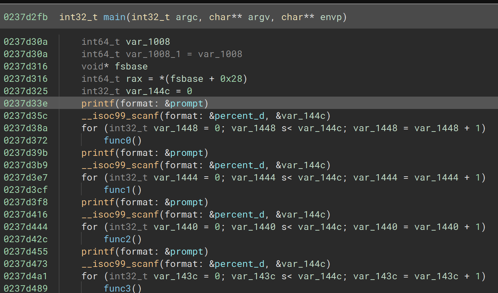
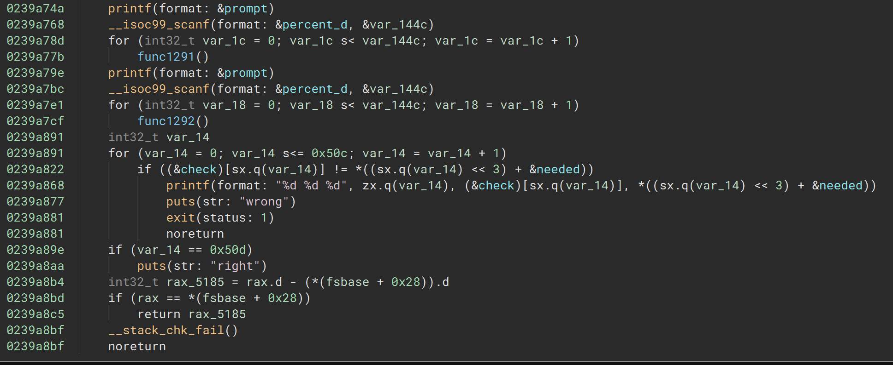
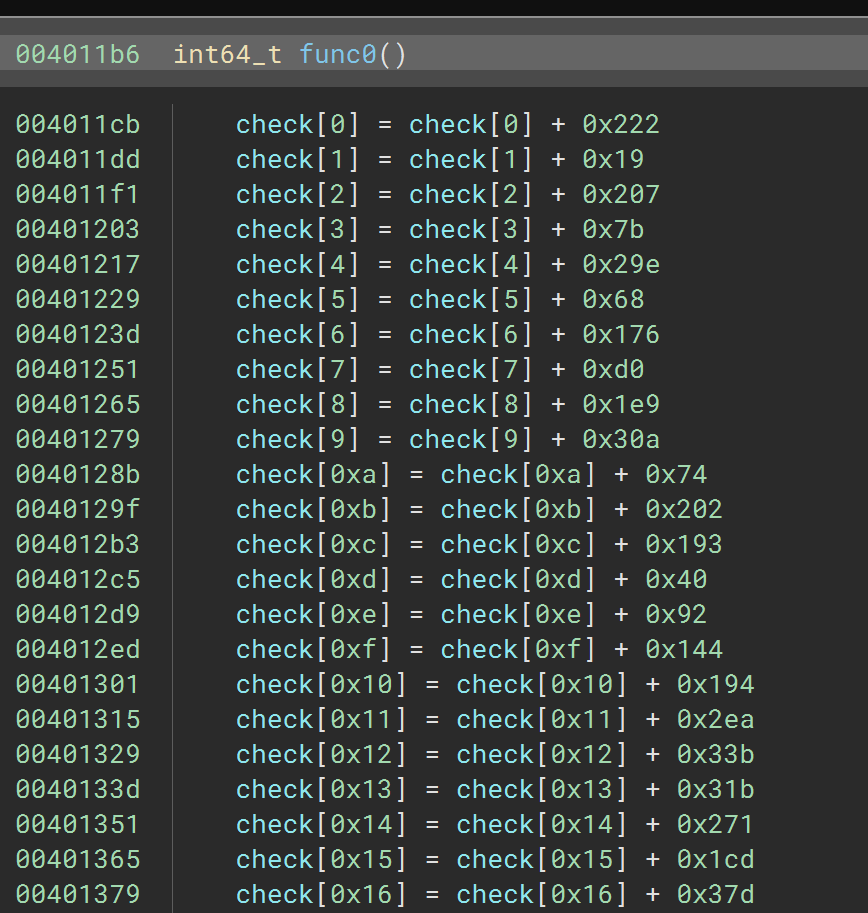

# [rev] Moon

This was a challenge requiring scripting of decompilers and a smidge linear algebra, I was the second one to solve it and found it very fun.

When opening it in Binary Ninja I immediately noticed that the decompilation of main() was taking quite some time. After waiting a couple of minutes this is what popped out.



And at the very end:



It seems to print a prompt, read in a number through `scanf` and run a function the amount of times indicated by said number. Each of the 1293 prompts has it's own associated function and they run in succession when the program is started.

It then compares the array `check` of 64-bit integers with `needed`, of the same type. If they mismatch at any point the program will terminate, printing `wrong`, otherwise it will print `right`.

Let's examine `func0()` to see what it does.



This goes on up until `check[0x50c]`, a.k.a 0x50d times, a.k.a 1293 times, the same as the number of functions in total. The numbers are seemingly random and all other `funcx()` functions look exactly like this one with only the added numbers being changed.

Already we can make a qualified guess that we will want to somehow extract these numbers. There are many ways to do this, for example by analyzing the raw instructions, but why bother if we can let Binja do the hard work and only analyze the squeaky clean HLIL (high level intermediate language) it produces.

[This is the script](./extract_coefficients.py) I used, which can just be copy-pasted into the Python console when you have the binary loaded in Binja.

```py
# Paste this in the Python console in Binary Ninja
# The functions *should* be in the right order
import json
rows = []
for func in bv.functions:
    if not func.name.startswith('func'): continue
    row = []
    print(func.name)
    # They are so big they might get skipped due to 
    # time restrictions
    if func.analysis_skipped:
        func.analysis_skip_override = FunctionAnalysisSkipOverride.NeverSkipFunctionAnalysis
    for line in map(str,func.hlil.root.lines):
        if '=' not in line: continue
        val = line.split('=')[1] # Get assignment value
        # There is an assignment to a temp
        # variable towards the end, we ignore that
        if not 'check' in val: continue
        # + 0 gets optimized away in the decompilation
        if not ('+' in val or '-' in val):
            row.append(0)
            continue
        # Sometimes it's  - - 1337 which wouldn't work with
        # int(), hopefully they didn't plant a trap :P
        row.append(eval(val.split(']')[1]))
    rows.append(row)
json.dump(rows, open('coeffs.json','w'))
```

If we recall what `main()` does, it will run each function the amount of times indicated by our input. This means that these additions are repeated `n` times, which can also be seen as multiplying each term by `n`. 

Since these functions add to the same array the effects on each element in `check` is the sum of each term in the previous functions multiplied by their corresponding coefficient.

This means the resulting `check` array is computed as follows, where each `x` is the input we supply.

```math
check=
x_{0}
\begin{bmatrix}546\\25\\\vdots\\519\end{bmatrix}+
x_{1}
\begin{bmatrix}378\\131\\\vdots\\36\end{bmatrix}+\ldots+
x_{1292}
\begin{bmatrix}824\\606\\\vdots\\66\end{bmatrix}
```

We know that we want `check` to equal `needed`. This is a system of linear equations which linear algebra let's us solve. We can put each of the functions' terms as columns in a matrix and solve for x in the equation Ax=b, which there already exists several libraries for.

I did at first try to use numpy's `np.linalg.solve` but since it works with floating point numbers it became too inaccurate and the output became corrupted. I ended up using SageMath instead which gave the correct integer solution. This is my final [solve script](./solve.sage), after having already extracted the matrix from Binja.
```py
import json
from struct import unpack
from sage.all import *

N = 0x50d
# The json is a list of rows with the terms
# of each function, we need them as columns
# so we transpose it
A = matrix(json.load(open('coeffs.json'))).transpose()
assert A.nrows() == A.ncols() == N

# Extracted offset of needed array from Binja
f = open('moon', 'rb')
f.seek(0x1fa8060)
needed = vector(unpack('Q'*N, f.read(8*N)))

ans = A.solve_right(needed)
print(''.join(map(chr, ans)))
```

Using this we get the flag:

`actf{3verything_is_just_linear_algebr4_33e431e52e896c92}`

I have not included the binary here since it was upwards of 30 MB in size. I might update with a link when the post-ctf repo goes public.

# [rev] Wordsearch

This was a reversing challenge that I completely cheesed, for better or worse.

We are given [a binary](./wordsearch) and a fun little kids' puzzle.
```
Word Search
Hey Kids! Can you solve the riddle of the rev? Find the string that matches this hint!
actf{(kh)k'k(Qj)Q'Q(2U)2'2(35)3'3(Ff)F(ul)u?hbjU5?'F(9M)9'9(4 C)4'4(iv)i?
ofM?'u?tCl?(SP)S'S'i?Pvh?_(k4)k'k(Q0)Q'Q(2Y)2'2(9 j)9'9(uB)u(S I)S(N7)N(o
H)o?40Yi?(3a)3'3(Fi)F'F'S(XG)X'o?arij?(4k)4'4'u(fs)f(d f)d?kBr?
(ix)i'i'X(cH)c'd(VZ)V(q x)q'q(DJ)D(W B)W?eIxG?
(sp)s's(xN)x'x(pD)p'p'N'W?pND7g?(Mq)M'M?uqH?'c'f'V?HsfZl?'D(eT)e'e(j N)j'j?
xJaT??BNr?_(kh)k'k(QS)Q'Q(2U)2'2(32)3'3(FZ)F(4s)4(XG)X?hSaU2?'F(97)9'9'4(S
w)S'S?nZ7s?(uc)u'u(iQ)i'i'X?cdwQG?_(k6)k'k(Qq)Q'Q(F8)F(9 8)9(i v)i(e
4)e?i6q?(2t)2'2(3i)3'3'F'9(4 u)4'4(p R)p(oK)o(f b)f(Vr)V(D8)D?tin8?
(us)u'u(SF)S'i(X 1)X'X(sS)s(NR)N(c 9)c(q o)q?8eus?'S'p(M X)M'f(W f)W(j
m)j?Fvx1?'s(xo)x'x'c?Sop?'M'e'j?rR?'N(d8)d?eRX?'o?sK9?'d'q'W?sb8?'V?iro?'D?
8v4??efm?}
```

Not exactly straight forward. Without digging into details it was evident that the binary we were given was traversing and parsing `argv[1]` and checking for similar characters as the ones in the puzzle above, such as `(` and `)`. It also reads `argv[2]` so it is reasonable to assume that it somehow matches our input onto this pattern, and if it matches we succeed.

At this point I tried using the tool I developed only a couple days earlier. It uses instruction counting as a side channel to try and leak if certain input characters are better then others. I have it published [here](https://github.com/TheBlupper/icscac). It allows you to use several different backends but I found `qemu` to work best here. At that point I just set the pattern as a fixed suffix and ran it with the standard forward-brute.

```bash
python3 -m icscac --brute-forward --arg -l 40 -bqemu -- ./wordsearch "actf{(kh)k'...efm?}" @@
```
```
inscount=105819 '0AAAAAAAAAAAAAAAAAAAAAAAAAAAAAAAAAAAAAAA'
inscount=105819 '1AAAAAAAAAAAAAAAAAAAAAAAAAAAAAAAAAAAAAAA'
inscount=105819 '2AAAAAAAAAAAAAAAAAAAAAAAAAAAAAAAAAAAAAAA'
inscount=105819 '3AAAAAAAAAAAAAAAAAAAAAAAAAAAAAAAAAAAAAAA'
...
inscount=118162 'actf{both_irregufar_and_inexpre9bi4e}00|'
inscount=118162 'actf{both_irregufar_and_inexpre9bi4e}00}'
inscount=118162 'actf{both_irregufar_and_inexpre9bi4e}00~'
found input actf{both_irregufar_and_inexpre9bi4e}000
```

Last time I checked `irregufar` and `inexpre9bi4e` weren't words, some slight inaccuracies are to be expected, but through a little bit of guesswork we can arrive at the correct flag.

`actf{both_irregular_and_inexpressive}`

I made this tool while upsolving `Pass the Check` from PlaidCTF, which was just last week. I just found it fun to be able to use it in a real setting so quickly.